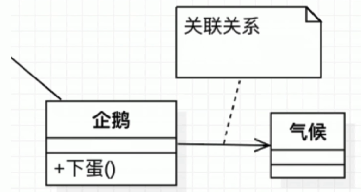
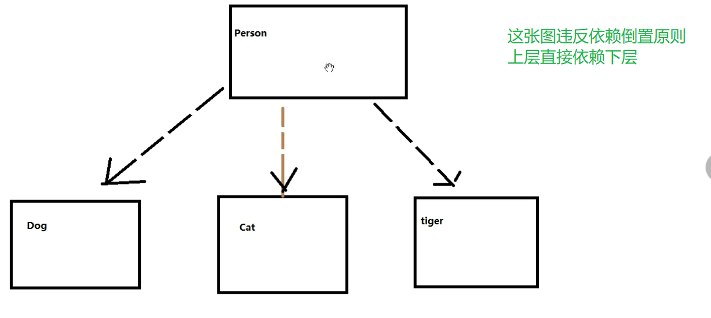
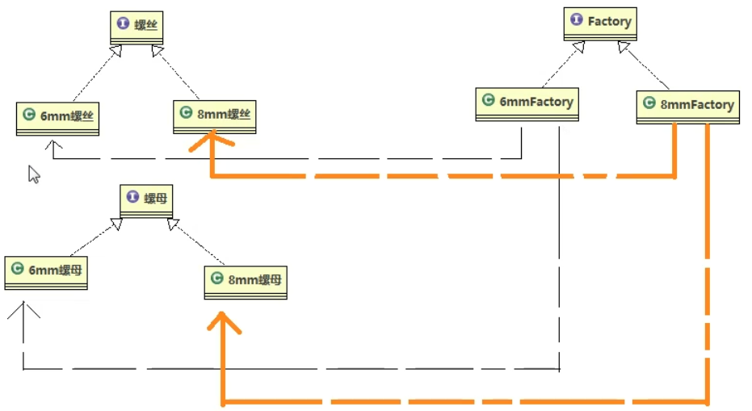
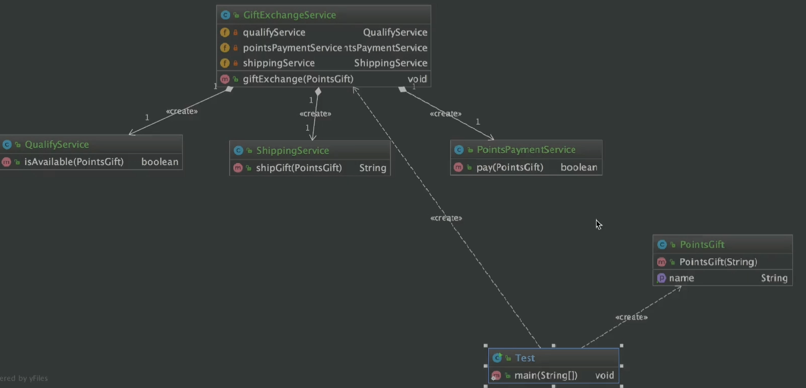
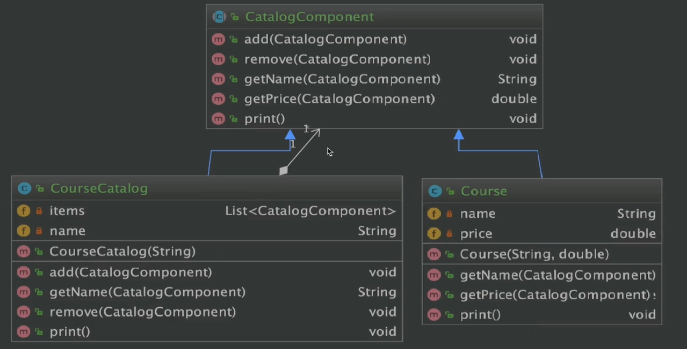

# Java设计模式精讲 Debug方式+内存分析

# 第一章 设计模式前言

```
1.设计模式,不是一种新的语言,也不是什么新api,更不是什么新的语法
2.设计模式,是前辈们,不断总结,不断打磨出的设计方法。不同设计模式适用于不同的场景。
3.设计模式,公认的有23种设计模式,分别对应23种设计场景。这些设计模式,我们不用怀疑它的功能!因为这些设计模式是经过   长期的实践考验,而留存下来的。
4.千万不要以为有任何一种设计模式,能解决任何问题,每一种设计模式只能用于适用的场景,而不是万能的。
5.设计模式有优点,也有缺点。我们不要为了适用设计模式而使用设计模式。切记防止“模式的滥用”
6.23种设计模式,背后其实是7大设计元素。也就是说,每个设计模式都归属于一个或多个设计原则。
7.7大设计原则的背后又是,一个字:分
8.7大设计原则,分别有:
	a.单一职责原则
	b.里氏替换原则
	C.依赖倒置原则
	d.开闭原则
	e.迪米特法则(最少知道原则)
	f.接口隔离原则
	g.组合优于继承原则
9.学习设计模式,脑袋里始终要绷紧2根弦:
	a.开发代码的程序猿,被划分为两种角色:
		作者(服务器端程序猿)
		用户(客户端程序猿)
		比如,我们使用c3p时,我们拿着别人写好的数据库连接池的字节码在使用,制作3p的程序猿就是作者
		而我们自己就是用户!
	b.我们手头并不会是时时刻刻都拥有作者的源代码的,比如在使用c3p0的时候,我们能用,但是我们找不到c3p0的源码文件(*.java),此时就算我们想改c3p0的源代码,都改不着就算我们手头真的有c3p0的源码,也不能改,因为要符合开闭原则。

```

---

# 第2章 UML急速入门

## 2-1 本章导航

### 一、UML定义

```
统一建模语言(英语: Unified Modeling Language,缩写uml）
非专利的第三代建模和规约语言
```

### 二、UML特点

```
UML是一种开放的方法
用于说明、可视化、构建和编写一个正在开发的面向对象的、软件密集系统的制品的开放方法
UML展现了一系列最佳工程实践这些最佳实践在对大规模,复杂系统进行建模方面,特别是在软件架构层次已经被验证有效
```

### 三、UML2.2分类

UML2.2中一共定义了14种图示,分类如下:

◆结构式图形:强调的是系统式的建模
◆行为式图形：强调系统模型中触发的事件
◆交互式图形:属于行为式图形子集合,强调系统模型中资料流程

#### 1.结构式图形

```
静态图(类图,对象图,包图)
实现图(组件图,部署图)
剖面图
复合结构图
```

#### 2.行为式图形

```
活动图
状态图
用例图
```

#### 3.交互式图形

```
通信图
交互概述图(UML2.0)
时序图(UML2.0)
时间图(UML2.0)
```

### 四、UML类图

◆ Class Diagram:用于表示类、接口、实例等之间相互的静态关系

◆ 虽然名字叫类图,但类图中并不只有类

### 五、类图记忆技巧

◆UML箭头方向:从子类指向父类
提示:可能会认为子类是以父类为基础的,箭头应从父类指向子类（这是错误的）

#### 1.记忆技巧-箭头方向

◆定义子类时需要通过 extends关键字指定父类

◆子类一定是知道父类定义的,但父类并不知道子类的定义

◆只有知道对方信息时才能指向对方

◆所以箭头方向是从子类指向父类

#### 2.记忆技巧-实线-继承|虚线-实现


```
空心三角箭头:继承或实现
实线-继承,is a关系,扩展目的,不虚,很结实
虚线-实现,虚线代表”虚”无实体
```

---


#### 3.记忆技巧-实线-关联|虚线-依赖



在企鹅类中声明一个气候的成员变量

企鹅受气候影响，箭头指向气候

---


箭头指向被依赖的类

新陈代谢这个功能需要借助氧气和水实现功能，其他时候不需要，若即若离的关系

```
◆虚线-依赖关系:临时用一下,若即若离,虚无缥缈,若有若无
◆表示一种使用关系,一个类需要借助另一个类来实现功能
◆一般是一个类使用另一个类做为参数使用,或作为返回值
```

```
◆实线-关联关系:关系稳定,实打实的关系,铁哥们
◆表示一个类对象和另一个类对象有关联
◆通常是一个类中有另一个类对象做为属性
```

#### 4.记忆技巧-空心菱形-聚合|实心菱形-组合

```
◆菱形就是一个盛东西的器皿(例如盘子)
◆聚合:代表空器皿里可以放很多相同东西,聚在一起(箭头方向所指的类
◆组合:代表满器皿里已经有实体结构的存在,生死与共
```


大雁群由大雁组成，局部与整体的关系

箭头指向局部

两者有着独立的生命周期


一只鸟有两只翅膀

鸟和翅膀有相同的生命周期

#### 5.记忆技巧-空心菱形-聚合

```
◆整体和局部的关系,两者有着独立的生命周期,是has a的关系
◆弱关系
◆消极的词:弱-空
```

#### 6.记忆技巧-实心菱形-组合

```
◆整体与局部的关系,和聚合的关系相比,关系更加强烈。两者有相同的生命周期, contains-a的关系
◆强关系
◆积极的词:强-满
```


---

### 六、UML时序图

```
◆ Sequence Diagram:是显示对象之间交互的图,这些对象是按时间顺序排列的。
◆ 时序图中包括的建模元素主要有:对象(Actor)、生命线( Lifeline)、控制焦点( Focus of control)、消息( Message)等
```


从上到下表示时间的流逝

---

## 2-2 UML类图讲解


---

## 2-3 UML类图讲解-自上而下


---

# 第3章 软件设计七大原则

## 3-1 本章导航

```
开闭原则
依赖倒置原则
单一职责原则
接口隔离原则
迪米特法则(最少知道原则)
里氏替换原则
合成/复用原则(组合/复用原则)
```

## 3-2 开闭原则讲解

```
◆定义:一个软件实体如类、模块和函数应该对扩展开放,对修改关闭。
◆用抽象构建框架,用实现扩展细节
◆优点:提高软件系统的可复用性及可维护性
```

```
开闭原则:
	a.对扩展新功能是开放的
	b.对修改原有功能是关闭的
比如:
	有一个刮胡刀,刮胡刀的作用就是刮胡子现在想让刮胡刀具备吹风机能力。
	违反开闭原则的做法就是:把吹风功能加上了,可能不能刮胡子了。
	符合开闭原则的做法就是:把吹风功能加上了,且没有影响以前的刮胡子功能。
	
补充:
	如果,一个类,从头到尾,都是你自己创建编写的,那么你可以随时随地修改源代码。因为作者就是你!
	如果,一个类,不是你写的,而是别人写的,就不能修改别人的代码了,而要符合开闭原则。
```

面向抽象编程

## 3-3 开闭原则coding

用抽象构建框架，用实现扩展细节

---

模拟慕课网授课

1. 先建一个接口

   ```java
   package com.geely.design.principle.openclose;
   
   /**
    * Created by geely
    * 以I开头命名表明这是个接口
    */
   public interface ICourse {
   
       // 课程id
       Integer getId();
   
       // 课程名称
       String getName();
   
       // 课程价格
       Double getPrice();
   
   
   }
   
   ```

   ---

2. 实现这个接口

   ```java
   package com.geely.design.principle.openclose;
   
   /**
    * Created by geely
    */
   public class JavaCourse implements ICourse{
       private Integer Id;
       private String name;
       private Double price;
   
       public JavaCourse(Integer id, String name, Double price) {
           this.Id = id;
           this.name = name;
           this.price = price;
       }
   
       public Integer getId() {
           return this.Id;
       }
   
       public String getName() {
           return this.name;
       }
   
       public Double getPrice() {
           return this.price;
       }
   
   }
   
   ```

3. 如果这门课打折，依照原则，新建类继承这个基类

   ```Java
   package com.geely.design.principle.openclose;
   
   /**
    * Created by geely
    */
   public class JavaDiscountCourse extends JavaCourse {
   
       public JavaDiscountCourse(Integer id, String name, Double price) {
           super(id, name, price);
       }
   
       public Double getDiscountPrice(){
           return super.getPrice()*0.8;
       }
   
   }
   
   ```

4. 测试

   ```java
   package com.geely.design.principle.openclose;
   
   /**
    * Created by geely
    */
   public class Test {
       public static void main(String[] args) {
           ICourse iCourse = new JavaDiscountCourse(96, "Java从零到企业级电商开发", 348d);
   
           // 对类型进行强转
           JavaDiscountCourse javaCourse = (JavaDiscountCourse) iCourse;
           System.out.println("课程ID:" + javaCourse.getId() + " 课程名称:" + javaCourse.getName() + " 课程原价:" + javaCourse.getPrice() + " 课程折后价格:" + javaCourse.getDiscountPrice() + "元");
   
   
       }
   }
   
   ```

5. UML类图
   

---

例二：

1. 

```java
package com.geely.design.principle.openclose;

public class Car {

    private String brand;
    private String color;
    private boolean louyou;
    private double price;

    public String getBrand() {
        return brand;
    }

    public void setBrand(String brand) {
        this.brand = brand;
    }

    public String getColor() {
        return color;
    }

    public void setColor(String color) {
        this.color = color;
    }

    public boolean isLouyou() {
        return louyou;
    }

    public void setLouyou(boolean louyou) {
        this.louyou = louyou;
    }

    public double getPrice() {
//        return price;
//        这是反例,违反了开闭原则,因为这里修改了源代码!!
        return price*0.8;
    }

    public void setPrice(double price) {
        this.price = price;
    }

    @Override
    public String toString() {
        return "Car{" +
                "brand='" + brand + '\'' +
                ", color='" + color + '\'' +
                ", louyou=" + louyou +
                ", price=" + price +
                '}';
    }
}

```

2. 

```java
package com.geely.design.principle.openclose;

public class DiscountCar extends Car{

    @Override
    public double getPrice() {
        return super.getPrice() * 0.8;
    }
}

```

3. 

```java
package com.geely.design.principle.openclose;

/**
 * 变化来了,现在所有汽车,需要打8折!!
 * 违反开闭原则的做法就是,直接打开Car的源代码,在 getPrice上修改
 * 符合开闭原则的做法就是,始终保证Car的源代码不会被修改,我们可以这样做:
 *  创建一个Car的子类重写getPrice的方法
 */
public class AppTest {

    public static void main(String[] args) {
//        Car car = new Car();

        DiscountCar car = new DiscountCar();
        car.setBrand("奔驰");
        car.setColor("黑色");
        car.setLouyou(true);
        car.setPrice(666666);

        System.out.println(car.getPrice());
    }
}

```


---

## 3-4 依赖倒置原则讲解+coding

```
◆定义:高层模块不应该依赖低层模块二者都应该依赖其抽象
◆抽象不应该依赖细节;细节应该依赖抽象
◆针对接口编程,不要针对实现编程
◆优点:可以减少类间的耦合性、提高系统稳定性,提高代码可读性和可维护性,可降低修改程序所造成的风险
```

程序要依赖抽象接口，而不是具体的实现

---

接口 ：不仅仅指interface，任何下层暴露给上层的方法，哪怕是个公共方法，也可以称为接口

---

Test是应用层，属于高层模块

什么是高层模块，低层模块？

controller层相对于service层就是高层模块，service层相对于dao层就是高层模块

调用别方法的，就是高层，被其他方法调用的，就是低层

---
模拟geely同学在慕课网上学习

1. 新建接口

   ```java
   package com.geely.design.principle.dependenceinversion;
   
   /**
    * Created by geely
    */
   public interface ICourse {
       void studyCourse();
   }
   
   ```

2. 准备学习的课程

   ```java
   package com.geely.design.principle.dependenceinversion;
   
   /**
    * Created by geely
    */
   public class FECourse implements ICourse {
       @Override
       public void studyCourse() {
           System.out.println("Geely在学习FE课程");
       }
   
   }
   
   ```

   ```java
   package com.geely.design.principle.dependenceinversion;
   
   /**
    * Created by geely
    */
   public class JavaCourse implements ICourse {
   
       @Override
       public void studyCourse() {
           System.out.println("Geely在学习Java课程");
       }
   }
   
   ```

   ```java
   package com.geely.design.principle.dependenceinversion;
   
   /**
    * Created by geely
    */
   public class PythonCourse implements ICourse {
       @Override
       public void studyCourse() {
           System.out.println("Geely在学习Python课程");
       }
   }
   
   ```

3. 新建Geely类

   ```java
   package com.geely.design.principle.dependenceinversion;
   
   /**
    * Created by geely
    *
    * 1.geely在学习慕课网课程的时候，具体的实现类交给高层模块（Test）,而不是针对geely
    * 这个实现类编写
    * 2.geely想学什么课，我们都可以在不动geely这个模块下任意修改
    */
   public class Geely {
   
       public void setiCourse(ICourse iCourse) {
           this.iCourse = iCourse;
       }
   
       private ICourse iCourse;
   
   
   
       public void studyImoocCourse(){
           iCourse.studyCourse();
       }
   
   
   }
   
   ```

4. 测试（应用层，高层）

   ```java
   package com.geely.design.principle.dependenceinversion;
   
   /**
    * Created by geely
    */
   public class Test {
   
       //v1
   //    public static void main(String[] args) {
   //        Geely geely = new Geely();
   //        geely.studyJavaCourse();
   //        geely.studyFECourse();
   //    }
   
       //v2
       // 接口方法注入的方式
   //    public static void main(String[] args) {
   //        Geely geely = new Geely();
   //        geely.studyImoocCourse(new JavaCourse());
   //        geely.studyImoocCourse(new FECourse());
   //        geely.studyImoocCourse(new PythonCourse());
   //    }
   
       //v3
   //    public static void main(String[] args) {
   //        Geely geely = new Geely(new JavaCourse());
   //        geely.studyImoocCourse();
   //    }
       public static void main(String[] args) {
           Geely geely = new Geely();
           geely.setiCourse(new JavaCourse());
           geely.studyImoocCourse();
   
           geely.setiCourse(new FECourse());
           geely.studyImoocCourse();
   
       }
   
   
   }
   
   ```

5. UML类图
   
   
   ---

---

反例：

```java
package com.geely.design.principle.dependenceinversion.negative;


//==========================作者=======================================
class Person {

    public void feed(Dog dog) {
        System.out.println("开始喂养。。。");
        dog.eat();
    }
}

class Dog {

    public void eat() {
        System.out.println("狗啃骨头");
    }
}


//===========================用户===========================================

public class AppTest {

    public static void main(String[] args) {
        Person p = new Person();
        Dog d = new Dog();

        p.feed(d);
    }
}

```

---

```java
package com.geely.design.principle.dependenceinversion.negative;


//==========================作者=======================================
class Person2 {

    public void feed(Dog2 dog) {
        System.out.println("开始喂养。。。");
        dog.eat();
    }
}

class Dog2 {

    public void eat() {
        System.out.println("狗啃骨头");
    }
}


//===========================用户===========================================


/**
 * 变化来了:客户端不仅仅需要喂狗,还需要喂猫!
 * 客户端自己定义一个猫类
 */

class Cat {
    public void eat() {
        System.out.println("猫吃鱼");
    }
}

public class AppTest2 {

    public static void main(String[] args) {
        Person2 p = new Person2();
        Dog2 d = new Dog2();
        Cat c = new Cat();

        p.feed(d);

        // 这里会报错？喂不了
//        p.feed(c);

        //此时,这种代码违反了依赖倒置,因为,每当下层变动时,上层都要跟着一起变动。
        //我们希望的是,当下层新增一个动物时,上层应该“不知道”,上层代码应该不用改动!
    }
}

```



正例：

```java
package com.geely.design.principle.dependenceinversion.positive;


//==========================作者=======================================

interface Animal {
    void eat();
}

class Person2 {

    public void feed(Animal a) {
        System.out.println("开始喂养。。。");
        a.eat();
    }
}

class Dog2 implements Animal{

    public void eat() {
        System.out.println("狗啃骨头");
    }
}


//===========================用户===========================================


/**
 * 变化来了:客户端不仅仅需要喂狗,还需要喂猫!
 * 客户端自己定义一个猫类
 */

class Cat implements Animal{
    public void eat() {
        System.out.println("猫吃鱼");
    }
}


class Tiger implements Animal {

    @Override
    public void eat() {
        System.out.println("老虎吃鸡");
    }
}

public class AppTest2 {

    public static void main(String[] args) {
        Person2 p = new Person2();
        Dog2 d = new Dog2();
        Cat c = new Cat();
        Tiger t = new Tiger();

        p.feed(d);
        p.feed(c);
        p.feed(t);


    }
}

```


---

##  3-5 单一职责原则讲解

```
◆定义:不要存在多于一个导致类变更的原因
◆一个类/接口/方法只负责一项职责
◆优点:降低类的复杂度、提高类的可读性,提高系统的可维护性、降低变更引起的风险
```

```
单一职责:
每个方法、每个类、每个框架都只负责一件事情。
比如:
	Math. round(),只负责完成四舍五入的功能,其他它不管!(方法)
 	Reader类,只负责读取文本文件(类)
 	SpringMVC,只负责简化MVC的开发(框架)

```


## 3-6 单一职责原则coding

代码一：类级别举例

1. 首先是没有遵守单一原则

   ```java
   package com.geely.design.principle.singleresponsibility;
   
   /**
    * Created by geely
    */
   public class Bird {
       public void mainMoveMode(String birdName){
           if("鸵鸟".equals(birdName)){
               System.out.println(birdName+"用脚走");
           }else{
               System.out.println(birdName+"用翅膀飞");
           }
       }
   }
   
   ```

2. 遵守单一原则

   ```java
   package com.geely.design.principle.singleresponsibility;
   
   /**
    * Created by geely
    */
   public class FlyBird {
       public void mainMoveMode(String birdName){
           System.out.println(birdName+"用翅膀飞");
       }
   }
   
   ```

   ```java
   package com.geely.design.principle.singleresponsibility;
   
   /**
    * Created by geely
    */
   public class WalkBird {
       public void mainMoveMode(String birdName){
           System.out.println(birdName+"用脚走");
       }
   }
   
   ```

3. 测试

   ```java
   package com.geely.design.principle.singleresponsibility;
   
   /**
    * Created by geely
    */
   public class Test {
       public static void main(String[] args) {
   //        Bird bird = new Bird();
   //        bird.mainMoveMode("大雁");
   //        bird.mainMoveMode("鸵鸟");
   
           FlyBird flyBird = new FlyBird();
           flyBird.mainMoveMode("大雁");
   
           WalkBird walkBird = new WalkBird();
           walkBird.mainMoveMode("鸵鸟");
   
       }
   }
   
   ```

   ---

   代码二：接口级别举例

   1. 没有遵守单一原则

      ```java
      package com.geely.design.principle.singleresponsibility;
      
      /**
       * Created by geely
       * 这里没有遵守单一职责
       * 需要进行拆分
       */
      public interface ICourse {
      
          /**获取课程信息*/
          String getCourseName();
          byte[] getCourseVideo();
      
      
          /**管理课程，和课程内容无关*/
          void studyCourse();
      
          // 退款操作
          // 退款之后，就无法获取课程名字与字节流
          // 这个操作影响上面两个操作
          // 所以可以拆分职责
          void refundCourse();
      
      }
      
      ```

   2. 重构

      ```java
      package com.geely.design.principle.singleresponsibility;
      
      /**
       * Created by geely
       * 课程内容
       */
      public interface ICourseContent {
          String getCourseName();
          byte[] getCourseVideo();
      }
      
      ```

      ```java
      package com.geely.design.principle.singleresponsibility;
      
      /**
       * Created by geely
       * 课程内容
       */
      public interface ICourseManager {
          void studyCourse();
          void refundCourse();
      }
      
      ```

      ```java
      package com.geely.design.principle.singleresponsibility;
      
      /**
       * Created by geely
       */
      public class CourseImpl implements ICourseManager,ICourseContent {
          @Override
          public void studyCourse() {
      
          }
      
          @Override
          public void refundCourse() {
      
          }
      
          @Override
          public String getCourseName() {
              return null;
          }
      
          @Override
          public byte[] getCourseVideo() {
              return new byte[0];
          }
      }
      
      ```

   3. UML类图
      

---

代码三：方法级别举例

```java
package com.geely.design.principle.singleresponsibility;

/**
 * Created by geely
 */
public class Method {


    /**********************下面的方法职责重叠********************/
    // 既更新了名字又更新了地址
    private void updateUserInfo(String userName,String address){
        userName = "geely";
        address = "beijing";
    }

    private void updateUserInfo(String userName,String... properties){
        userName = "geely";
//        address = "beijing";
    }

    /***********************************************/


    
    /**********************重构如下********************/
    private void updateUsername(String userName){
        userName = "geely";
    }
    private void updateUserAddress(String address){
        address = "beijing";
    }

    /***********************************************/


    // 像这种方法的，建议重构
    private void updateUserInfo(String userName,String address,boolean bool){

        // 像这样的，明显是两个职责，建议拆开
        if(bool){
            //todo something1
        }else{
            //todo something2
        }


        userName = "geely";
        address = "beijing";
    }


}

```

---

代码四：

1. 

```java
package com.geely.design.principle.singleresponsibility;

import java.io.FileNotFoundException;
import java.io.FileReader;
import java.io.IOException;
import java.io.Reader;
import java.lang.reflect.Array;
import java.util.Arrays;

public class AppTest {

    public static void main(String[] args) throws IOException {

        //统计一个文本文件中,有多少个字符。
        //字符流查码表，能读中文；字节流不查码表
        // Reader默认查询的码表是与操作系统一致的码表,我们的操作系统是中文的,所以 Reader就会使用GBK码表
        //而GBK码表一个汉字占2个字节，且汉字的两个字节,都是以1开头的
        // utf-8码表一个汉字占3个字节
        // 读取到记事本中的数字--->gbk--->北---> unicode--->21271
        Reader in = new FileReader("F:\\1.txt");

//        int n = in.read();
//        System.out.println(n + " " + (char)n);

        int n;
        int count = 0;
        while ((n=in.read()) != -1) {
            count++;
        }

        System.out.println(count);
        in.close();


//        String s= "北";
//
//        // 编码:字符--》码表--》数字
//        // 解码:数字--》码表--》字符
//        byte[] bb = s.getBytes("gbk");
//        System.out.println(Arrays.toString(bb));
//
//        byte[] bb2 = s.getBytes("unicode");
//
//        System.out.println(Arrays.toString(bb2));


    }
}

```

2. 

```java
package com.geely.design.principle.singleresponsibility;

import java.io.BufferedReader;
import java.io.FileReader;
import java.io.IOException;
import java.io.Reader;

public class AppTest2 {

    public static void main(String[] args) throws IOException {

        //统计一个文本文件中,有多少个单词。
        Reader in = new FileReader("E:\\infos.txt");

        BufferedReader br = new BufferedReader(in);

        String line = null;
        StringBuffer sb = new StringBuffer("");

        while ((line = br.readLine()) != null) {

            sb.append(line);
            sb.append(" ");


        }

        // 关闭，只关上层流
        br.close();

        // 以不是英文字母的作为分割符
        String[] words = sb.toString().split("[^a-zA-Z]+");


        System.out.println(words.length);
    }
}

```

3. 

```java
package com.geely.design.principle.singleresponsibility;

import java.io.BufferedReader;
import java.io.FileReader;
import java.io.IOException;
import java.io.Reader;

/**
 * 这个程序就做了两件事
 *  1.读取文件
 *  2.统计操作
 */
public class AppTest3 {

    public static void main(String[] args) throws IOException {

        //统计一个文本文件中,有多少个句子。
        Reader in = new FileReader("E:\\infos.txt");

        BufferedReader br = new BufferedReader(in);

        String line = null;
        StringBuffer sb = new StringBuffer("");

        while ((line = br.readLine()) != null) {

            sb.append(line);
            sb.append(" ");


        }

        // 关闭，只关上层流
        br.close();


        // 以.!?。的作为分割符
        String[] words = sb.toString().split("[\\.!?。]+");


        System.out.println(words.length);


    }
}

```


```
以上代码,违反了单一职责,缺点是
1.代码的重用性不高,如果有其他需求必须,需要统计一个文件中的句子数量,则必须把文件加载到字符串中的代码,再写一遍。
2.可读性低,别人一看这个方法,首先会被具体的算法搞晕,看代码的人根本看不出这个代码要干什么。
```

4. 

```java
package com.geely.design.principle.singleresponsibility;

import java.io.*;

public class AppTest4 {

    public static String loadFile(String path) throws IOException {

        Reader in = new FileReader(path);

        BufferedReader br = new BufferedReader(in);

        String line = null;
        StringBuffer sb = new StringBuffer("");

        while ((line = br.readLine()) != null) {
            sb.append(line);
            sb.append(" ");
        }

        // 关闭，只关上层流
        br.close();

        return sb.toString();
    }


    public static String[] words(String string) {
        // 以不是英文字母的作为分割符
        String[] words = string.split("[^a-zA-Z]+");
        return words;
    }

    /**
     * 现在的代码就符合单一职责了,优点如下:
     * 1.代码重用性提高了
     * 2.代码可读性性提高了,此时的代码就像一个大纲一样的。
     * @param args
     * @throws IOException
     */
    public static void main(String[] args) throws IOException {

        //统计一个文本文件中,有多少个单词。
        String str = loadFile("E:\\infos.txt");


        String[] words = words(str);

        System.out.println(words.length);

    }
}

```


总结：在实际开发中，接口和方法要做到单一职责

---

## 3-7 接口隔离原则讲解+coding

```
◆定义:用多个专门的接口,而不使用单一的总接口,客户端不应该依赖它不需要的接口
◆一个类对一个类的依赖应该建立在最小的接口上
◆建立单一接口,不要建立庞大臃肿的接口
◆尽量细化接口,接口中的方法尽量少
◆注意适度原则,一定要适度
◆优点:符合我们常说的高内聚低耦合的设计思想，从而使得类具有很好的可读性、可扩展性和可维护性。
```

降低依赖关系，降低了耦合。减少对外的交互，使接口中最少的方法完成最多的事情，即提高了内聚

---

代码演示：

1. 首先是没有遵守接口隔离原则的例子
   接口

   ```java
   package com.geely.design.principle.interfacesegregation;
   
   /**
    * Created by geely
    */
   public interface IAnimalAction {
       void eat();
       void fly();
       void swim();
   
   }
   
   ```

   实现

   ```java
   package com.geely.design.principle.interfacesegregation;
   
   /**
    * Created by geely
    */
   public class Bird implements IAnimalAction {
       @Override
       public void eat() {
   
       }
   
       @Override
       public void fly() {
   
       }
   // 很明显，鸟不会游泳，swim()这个方法会是个空实现
       @Override
       public void swim() {
   
       }
   }
   
   ```

   很明显，鸟不会游泳，swim()这个方法会是个空实现

   ---

2. 接口细化
   接口

   ```java
   package com.geely.design.principle.interfacesegregation;
   
   /**
    * Created by geely
    */
   public interface IEatAnimalAction {
       void eat();
   }
   
   ```

   ```java
   package com.geely.design.principle.interfacesegregation;
   
   /**
    * Created by geely
    */
   public interface IFlyAnimalAction {
       void fly();
   }
   
   ```

   ```java
   package com.geely.design.principle.interfacesegregation;
   
   /**
    * Created by geely
    */
   public interface ISwimAnimalAction {
       void swim();
   }
   
   ```

   实现

   ```java
   package com.geely.design.principle.interfacesegregation;
   
   /**
    * Created by geely
    */
   public class Dog implements ISwimAnimalAction,IEatAnimalAction {
   
       @Override
       public void eat() {
   
       }
   
       @Override
       public void swim() {
   
       }
   }
   
   ```

   ---

   单一职责与接口隔离原则的区别：

   ```
   1.单一职责指的是接口，类，方法的职责是单一的，强调的是职责，也就是在一个接口里，只要职责是单一的，有多个方法也可以。约束的是接口，类，方法；针对的是程序中的实现与细节
   2.接口隔离原则注重的是对接口依赖的隔离，约束的是接口。是针对抽象，针对程序整体框架的构建
   ```

   

----

## 3-8 迪米特法则讲解+coding

```
◆定义:一个对象应该对其他对象保持最少的了解。又叫最少知道原则
◆尽量降低类与类之间的耦合
◆优点:降低类之间的耦合、
```

```
◆强调只和朋友交流,不和陌生人说话
◆朋友:
出现在成员变量、方法的输入、输出参数中的类称为成员朋友类,而出现在方法体内部的类不属于朋友类。
```

```
什么是朋友:
a类中的字段
b.方法的参数
C.方法的返回值
d.方法中实例化出来的对象
```

```
迪米特法则,也叫做最少知道原则(封装)
一个类,对于其他类,要知道的越深越好。
只和朋友通信
```

---

举例：电脑关机

反例：

```java
package com.geely.design.principle.demeter.negative;

class Computer {

    public void saveData() {
        System.out.println("保存数据");
    }

    public void killProcess() {
        System.out.println("关闭程序");
    }

    public void closeScreen() {
        System.out.println("关闭屏幕");
    }

    public void poweroff() {
        System.out.println("断电");
    }

}

class Person {
    private Computer c = new Computer();

    //此时,这个 Person对于Computer的细节就知道的太多了。
    //对于 Preson而言,只需要知道,关机按钮在哪就行,不需要知道如何保存数据,如何关闭进程,如果断电等等这些细节...
    //这样的话,代码的复杂度就提升了!! 万一用户使用不当,就有可能造成更大的损失。
    public void shutdownComputer() {
        c.saveData();
        c.killProcess();
        c.closeScreen();
        c.poweroff();
    }
}

public class AppTest {
    public static void main(String[] args) {

    }
}

```

正例：

```java
package com.geely.design.principle.demeter.positive;

class Computer {

    private void saveData() {
        System.out.println("保存数据");
    }

    private void killProcess() {
        System.out.println("关闭程序");
    }

    private void closeScreen() {
        System.out.println("关闭屏幕");
    }

    private void poweroff() {
        System.out.println("断电");
    }

    public void shutDown() {
        saveData();
        killProcess();
        closeScreen();
        poweroff();
    }

}

class Person {

    private Computer c = new Computer();

    public void shutdownComputer() {
        c.shutDown();
    }
}

public class AppTest {
    public static void main(String[] args) {

    }
}

```

---

可以适当地违反迪米特法则

---

举例：模拟慕课网老板询问负责人网站有多少课程

1. 课程类

   ```java
   package com.geely.design.principle.demeter;
   
   /**
    * Created by geely
    */
   public class Course {
   }
   
   ```

2. Boss类

   ```java
   package com.geely.design.principle.demeter;
   
   
   import java.util.ArrayList;
   import java.util.List;
   
   /**
    * Created by geely
    */
   public class Boss {
   
       // 给负责人下指令，查看课程数目
       // 这里的朋友有哪些？
       // TeamLeader作为入参，是直接的朋友
       // void作为输出，也是直接的朋友
       // 方法体内部的类不算是朋友，比如Course
       // Boss和TeamLeader是直接的关系，Boss不应该与陌生Course发生交流
       public void commandCheckNumber(TeamLeader teamLeader){
   
   //        List<Course> courseList = new ArrayList<Course>();
   //
   //        // 一页一页查找课程
   //        for(int i = 0 ;i < 20;i++){
   //            courseList.add(new Course());
   //        }
           teamLeader.checkNumberOfCourses();
       }
   
   }
   
   ```

3. TeamLeader类

   ```java
   package com.geely.design.principle.demeter;
   
   import java.util.ArrayList;
   import java.util.List;
   
   /**
    * Created by geely
    */
   public class TeamLeader {
   
   
       public void checkNumberOfCourses(){
   
           List<Course> courseList = new ArrayList<Course>();
   
           // 一页一页查找课程
           for(int i = 0 ;i < 20;i++){
               courseList.add(new Course());
           }
           System.out.println("在线课程的数量是："+courseList.size());
       }
   
   }
   
   ```

4. 测试

   ```java
   package com.geely.design.principle.demeter;
   
   /**
    * Created by geely
    */
   public class Test {
       public static void main(String[] args) {
           Boss boss = new Boss();
           TeamLeader teamLeader = new TeamLeader();
           boss.commandCheckNumber(teamLeader);
   
       }
   }
   
   ```

   ---

## 3-9 里氏替换原则讲解

   ```
   里氏替换原则
   	任何能使用父类对象的地方,都应该能透明地替换为子类对象。
   	也就是说,子类对象可以随时随地替换父类对象,且替换完以后,语法不会报错,业务逻辑也不会出现问题!
   ```

   ```
   方法重写:
   	在子类和父类中,出现了返回类型相同、方法名相同、方法参数相同的方法时,构成方法重写
   方法重写的两个限制:
   	1.子类重写父类的方法时,子类方法的访问修饰符不能比父类的更严格
   		父类是public，子类就不能是private
   	2.子类重写父类的方法时,子类方法不能抛出比父类更多的异常
   为什么要有以上这2个限制。
   	就是为了保证,在子类对象替换父类对象后,语不会报错!
   ```

   ```
   继承的作用:
   	1.提高代码重用性。
   	2.多态的前提。
   两个类能不能发生继承关系的依据是什么?
   	a.主要看有没有"i sa关系。
   	b.在两个类有了is a关系之后,还要考虑子类对象在替换了父类对象之后,业务逻辑是否变化!如果变化,则不能发生继承关系。
   正方形和长方形有“is a”关系。那么我们能不能让正方形类就直接去继承长方形类呢?现在不能了!!
   	举例：正方形是长方形吗
   		鸵鸟非鸟
   为什么呢?
   	因为还要考虑业务场景,看看在特定的业务场景下,正方形能替换了长方形以后,业务逻辑是否变化!
   ```

---

举例：正方形是长方形吗

1. 四边形

   ```java
   package com.geely.design.principle.liskovsubstitution;
   
   /**
    * Created by geely
    * 四边形
    */
   public interface Quadrangle {
       long getWidth();
       long getLength();
   
   }
   
   ```

2. 长方形

   ```java
   package com.geely.design.principle.liskovsubstitution;
   
   /**
    * Created by geely
    */
   public class Rectangle implements Quadrangle {
       private long length;
       private long width;
   
       @Override
       public long getWidth() {
           return width;
       }
   
       @Override
       public long getLength() {
           return length;
       }
   
       public void setLength(long length) {
           this.length = length;
       }
   
       public void setWidth(long width) {
           this.width = width;
       }
   }
   
   ```

3. 正方形

   ```java
   package com.geely.design.principle.liskovsubstitution;
   
   /**
    * Created by geely
    */
   public class Square implements Quadrangle {
       private long sideLength;
   
       public long getSideLength() {
           return sideLength;
       }
   
       public void setSideLength(long sideLength) {
           this.sideLength = sideLength;
       }
   
       @Override
       public long getWidth() {
           return sideLength;
       }
   
       @Override
       public long getLength() {
           return sideLength;
       }
   }
   
   ```

4. 测试

   ```java
   package com.geely.design.principle.liskovsubstitution;
   
   /**
    * Created by geely
    */
   public class Test {
       
       // 这个方法只有长方形适用，正方形并不适用
       public static void resize(Rectangle rectangle){
           while (rectangle.getWidth() <= rectangle.getLength()){
               rectangle.setWidth(rectangle.getWidth()+1);
               System.out.println("width:"+rectangle.getWidth() + " length:"+rectangle.getLength());
           }
           System.out.println("resize方法结束 width:"+rectangle.getWidth() + " length:"+rectangle.getLength());
       }
   
   //    public static void main(String[] args) {
   //        Rectangle rectangle = new Rectangle();
   //        rectangle.setWidth(10);
   //        rectangle.setLength(20);
   //        resize(rectangle);
   //    }
       public static void main(String[] args) {
           Square square = new Square();
   //        square.setLength(10);
   //        resize(square);
       }
   
   
   }
   
   ```

   ---
 ##  3-10 合成复用原则讲解+coding

   

```
组合优于继承。（ 合成复用）
继承就是一个类继承另外一个类。
我们已经知道,类和类之间有3种:
	a.继承
	b.依赖 ：一个类的对象作为另一个类的局部变量（方法中的变量）
	C.关联：一个类的对象作为另一个类的字段
		“关联”可以细分为:
			1)组合 鸟和翅膀
			2)聚合 大雁群和大雁
			所谓的组合,是关系强,聚合是关系弱。
			
组合于继承中的组合,其实只得就是关联关系
```

---

举例：

1. 代码一：

   ```java
   package com.geely.design.principle.compositionaggregation;
   
   import java.util.Collection;
   import java.util.HashSet;
   
   /**
    * 需求：制作一个集合，要求该集合能记录曾今加过多少个元素(不是统计某一时刻集合中有多少个元素。)
    *
    * 举例：加入3个元素,(a,b,c)
    *      减去2个元素（a）
    *      返回：3（因为加入过3个元素）
    */
   
   class Myset extends HashSet {
   
       private int count = 0;
   
       // 重写add方法
       @Override
       public boolean add(Object o) {
   
           count++;
           return super.add(o);
       }
   
       @Override
       public boolean addAll(Collection c) {
   
           System.out.println(count+"  " +c.size() +"~~~~");
           count += c.size();
           return super.addAll(c);
       }
   
       public int getCount() {
           return count;
       }
   }
   
   //问题是,在执行了 addAll之后, count不是3,而是6,为什么呢?因为 addAll回调了add方法
   //所以,这样的代码没有解决需求。
   //针对于a包的问题,add11会回调add方法,我们修改代码如下:把addA11删除掉,不要重写父类 HashSet的addA11了
   //反正父类的addA11本身就会去回调add.
   
   
   /**
    * 此时,这个代码看起来好像很完美,已经满足了需求了。
    * 问题是:目前这个代码,必须依赖于这样一个事实:就是 HashSet的addA11方法必须去回调add方法。
    * 万一在将来的jdk版本中, HashSet的addA11实现代码,突然不再回调add方法了,
    * 则在将来的这个jdk版本中,我们自定义的这个 MySet就被“撼动”
    * 比如: HashMap,在jdk1.6 1.7 1.8中,底层实现分别换了3次
    */
   public class AppTest {
   
       public static void main(String[] args) {
   
           Myset myset = new Myset();
   
           HashSet<Object> set = new HashSet<>();
           set.add("a");
           set.add("b");
           set.add("c");
   
           myset.addAll(set);
           System.out.println(myset.getCount());
       }
   }
   
   ```

   ---

2. 代码二：

   ```java
   package com.geely.design.principle.compositionaggregation;
   
   import java.util.Collection;
   import java.util.HashSet;
   
   /**
    * 需求：制作一个集合，要求该集合能记录曾今加过多少个元素(不是统计某一时刻集合中有多少个元素。)
    * 针对于以上问题, MySet必须依赖于这样一个事实: addAll必须回调add,但是jdk未来的版本,不会做这个保证!
    * 修改代码如下:我们自己亲自重写addA1,这次重写 addAl1,不再让 count累加c.size()了,
    * 而是保证addA11一定会调用add
    */
   
   class Myset2 extends HashSet {
   
       private int count = 0;
   
       // 重写add方法
       @Override
       public boolean add(Object o) {
   
           count++;
           return super.add(o);
       }
   
       @Override
       public boolean addAll(Collection c) {
   
           // 照着源码去写
           boolean bb = false;
           for (Object o : c) {
               if (add(o)) {
                   bb = true;
               }
           }
           return bb;
       }
   
       public int getCount() {
           return count;
       }
   }
   
   
   
   
   /**
    * 此时,这个代码看起来好像很完美,已经满足了需求了。
    *
    *问题是:
    * 1.如果在新的jdk版本中, HashSet突然多了一个元素加入集合的入口方法: addSome,
    *  这个 addSome是我们始料未及的,我们的 MySet根本没有重写
    *  新版本中出现的 addSome方法。这样,在新版本中,
    *  我们的 MySetaddSome也继承了方法当使用 addSome方法添加元素时,
    *  根本不会去统计元素的数量。
    * 2.我们重写了adda11方法,和add方法,要知道,在 HashSet的所有方法中,难免有一些其他方法,会依赖于 addAll方法和add方法的.我们没头没脑
    * 地重写了别人类中的某些方法,就会导致其他依赖于些方法的方法,出现问题!
    */
   public class AppTest2 {
   
       public static void main(String[] args) {
   
           Myset2 myset = new Myset2();
   
           HashSet<Object> set = new HashSet<>();
           set.add("a");
           set.add("b");
           set.add("c");
   
           myset.addAll(set);
           System.out.println(myset.getCount());
       }
   }
   
   ```

3. 代码三：

   ```java
   package com.geely.design.principle.compositionaggregation;
   
   import java.util.Collection;
   import java.util.HashSet;
   
   /**
    * 需求：制作一个集合，要求该集合能记录曾今加过多少个元素(不是统计某一时刻集合中有多少个元素。)
    * 针对于之前提出的2个问题
    * 修改代码如下:
    * 1.我们不再重写add和addA11方法了。
    * 2.我们额外制作2个代替add和addAl的方法:add2，addall2
    *  还要在类的API文档中说明,每当使用add和adda11的时候,都去调用dd2和addall2
    */
   
   class Myset3 extends HashSet {
   
       private int count = 0;
   
       // 重写add方法
       public boolean add2(Object o) {
   
           count++;
           return super.add(o);
       }
   
       public boolean addAll2(Collection c) {
   
           // 照着源码去写
           boolean bb = false;
           for (Object o : c) {
               if (add2(o)) {
                   bb = true;
               }
           }
           return bb;
       }
   
       public int getCount() {
           return count;
       }
   }
   
   
   /**
    *此时,这个代码看起来好像很勉强,但是也是满足了需求了。
    * 问题是:
    * 1.目前这种情况对用户要求优点过分,用户必须看类的api文档,看完了还要乖乖地使用add2和addA112.不能写错
    * 2.更致命的问题是:就是那么寸,在jdk新版本中, HashSet恰恰多了一个api,叫add2和adda112.
    *
    * 继承,已经尽忠了
    */
   public class AppTest3 {
   
       public static void main(String[] args) {
   
           Myset3 myset = new Myset3();
   
           HashSet<Object> set = new HashSet<>();
           set.add("a");
           set.add("b");
           set.add("c");
   
           myset.addAll2(set);
           System.out.println(myset.getCount());
       }
   }
   
   ```

4. 代码四：

   ```java
   package com.geely.design.principle.compositionaggregation;
   
   import java.util.Collection;
   import java.util.HashSet;
   import java.util.Set;
   
   /**
    * 需求：制作一个集合，要求该集合能记录曾今加过多少个元素(不是统计某一时刻集合中有多少个元素。)
    * 针对于之前提出的2个问题
    *  修改代码如下:
    * 1.我们的 MySet,再也不要去继承 HashSet了。
    * 2.取而代之,我们让MySetHashSet和发生关联关系(组合)
    */
   
   class Myset4 extends HashSet {
   
       private Set set = new HashSet();
   
       private int count = 0;
   
       // 重写add方法
       public boolean add(Object o) {
   
           count++;
           return set.add(o);
       }
   
       public boolean addAll(Collection c) {
   
          count += c.size();
          return set.addAll(c);
       }
   
       public int getCount() {
           return count;
       }
   }
   
   
   /**
    *此时,可以说一声:完美。
    * 组合的优点,我们已经体会到了。
    * 问题是:
    * 1.难道以后都不能使用继承了吗?
    * 2.难道以后都不能进行方法重写了吗?
    * 如果父类作者,和子类的作者,不是同一个人。就别继承。
    * 那么父类作者,不知道,未来的子类,会重写自己的哪个方法。
    * 那么子类作者,不知道,未来的父类,会加入什么新方法,
    * 如果父类作者,和子类的作者,就是同一个人,那就可以放开手脚去使用继承了
    * 自己当然知道,每个方法都是什么作用。作者可以同时控制父类和子类。
    * 我们自己写代码,继承,重写,随便使用。
    * 如果我们仅仅是为了复用代码,而继承别人的类,难免出现“沟通”上的问题。
    */
   public class AppTest4 {
   
       public static void main(String[] args) {
   
           Myset4 myset = new Myset4();
   
           HashSet<Object> set = new HashSet<>();
           set.add("a");
           set.add("b");
           set.add("c");
   
           myset.addAll(set);
           myset.add("d");
           System.out.println(myset.getCount());
       }
   }
   
   ```

---


# 第4章 简单工厂讲解


```
学习工厂设计模式,必须知道的相关概念:
1.产品:
	类
2.抽象产品:
	抽象类、接口
3.产品簇
	多个有内在联系,或者是有逻辑关系的产品。
	比如三秦套餐中,凉皮+冰峰+肉夹馍
4.产品等级
```


```
简单工厂的作用:
	把具体产品的类名,从客户端代码中解耦
```


```
简单工厂定义与类型
◆定义由一个工厂对象决定创建出哪一种产品类的实例
◆类型创建型,但不属于GOF23种设计模式
```

```
简单工厂-适用场景
◆工厂类负责创建的对象比较少
◆客户端(应用层)只知道传入工厂类的参数，对于如何创建对象(逻辑)不关心
```

```
简单工厂优点
◆只需要传入一个正确的参数,就可以获取你所需要的对象，而无须知道其创建细节

```

```
简单工厂-缺点
◆工厂类的职责相对过重,增加新的产品，需要修改工厂类的判断逻辑,违背开闭原则
```

---

反例：

```java
package com.geely.design.pattern.creational.simplefactory.a;

// 抽象产品
interface Food {
    void eat();
}

// 具体产品
class Hamburger implements Food {

    @Override
    public void eat() {
        System.out.println("吃汉堡包！！！");
    }
}


//=======================================================

/**
 * 这种设计相当脆弱!为什么呢?因为,只要作者修改了具体产品的类名,那么客户端代码,也要随之一起改变。
 * 这样服务器端代码,和客户端代码就是耦合的!
 * 我们希望的效果是,无论服务器端代码如何修改,客户端代码都应该不知道,不用修改客户端代码!
 */
public class AppTest {

    public static void main(String[] args) {
        Food f = new Hamburger();
        f.eat();
    }
}

```

正例：

```java
package com.geely.design.pattern.creational.simplefactory.b;

/**
 * 针对于a包的问题:服务器端代码一旦修改,客户端代码也要跟着修改!
 * 修改代码如下,使用简单工厂设计模式。
 */

// 抽象产品
interface Food {
    void eat();
}

// 具体产品
class Hamburger implements Food {

    @Override
    public void eat() {
        System.out.println("吃汉堡包！！！");
    }
}

// 具体产品
class RiceNoodle implements Food {

    @Override
    public void eat() {
        System.out.println("吃过桥米线！！！");
    }
}

class FoodFactory {
    public static Food getFood(int n) {
        Food food = null;
        switch (n) {
            case 1:
                food = new Hamburger();
                break;
            case 2:
                food = new RiceNoodle();
                break;
        }
        return food;
    }
}
//=======================================================

/**
 * 简单工厂
 * 优点
 * 1.把具体产品的类型,从客户端代码中,解耦出来。
 * 2.服务器端,如果修改了具体产品的类名,客户端也知道!
 * 这便符合了“面向接口编程”的思想
 *
 * 缺点
 * 1.客户端不得不死记硬背那些常量与具体产品的映射关系,比如:1对应汉堡包,2对应米线
 * 2.如何具体产品特别多,则简单工厂,就会变得十分臃肿。比如有100个具体产品,则需要在简单工厂的 switch中写出1个case
 * 3.最重要的是,变化来了:客户端需要扩展具体产品的时候,势必要修改简单工厂中的代码,这样便违反了“开闭原则”
 */
public class AppTest {

    public static void main(String[] args) {
        Food f = FoodFactory.getFood(1);
        f.eat();
    }
}

```

----


---

# 第5章 工厂方法模式讲解

```
工厂方法定义与类型
◆定义:定义一个创建对象的接口，但让实现这个接口的类来决定实例化哪个类，工厂方法让类的实例化推迟到子类中进行
◆类型:创建型
```

```
工厂方法-适用场景
◆创建对象需要大量重复的代码
◆客户端(应用层)不依赖于产品类实例如何被创建、实现等细节
◆一个类通过其子类来指定创建哪个对象
```


## 5-1 code

```java
package com.geely.design.pattern.creational.factorymethod;

/**
 *针对于简单工厂的问题:
 * 修改代码如下,使用工厂方法设计模式。
 */

// 抽象产品
interface Food {
    void eat();
}

// 具体产品
class Hamburger implements Food {

    @Override
    public void eat() {
        System.out.println("吃汉堡包！！！");
    }
}

// 具体产品
class RiceNoodle implements Food {

    @Override
    public void eat() {
        System.out.println("吃过桥米线！！！");
    }
}


interface FoodFactory {
    public Food getFood();
}

class HamburgerFactory implements FoodFactory {

    @Override
    public Food getFood() {
        return new Hamburger();
    }
}

class RiceNoodleFactory implements FoodFactory {

    @Override
    public Food getFood() {
        return new RiceNoodle();
    }
}

class Bussiness {
    public static void taste(FoodFactory ff) {
        Food f = ff.getFood();
        System.out.println("评委1，品尝");
        f.eat();

        Food f2 = ff.getFood();
        System.out.println("评委2，品尝");
        f2.eat();

        Food f3 = ff.getFood();
        System.out.println("评委3，品尝");
        f3.eat();
    }
}


//=======================================================

class Lp implements Food {

    @Override
    public void eat() {
        System.out.println("从小就吃凉皮");
    }
}

class LpFactory implements FoodFactory {

    @Override
    public Food getFood() {

        return new Lp();
    }
}

/**
 * 工厂方法
 * 优点:
 *  1.仍然具有简单工厂的优点:服务器端修改了具体产品的类名以后,客户端不知道!
 *  2.当客户端需要扩展一个新的产品时,不需要修改作者原来的代码,只是扩展一个新的工厂而已!
 * 杠点:
 *  1.我们已经知道,简单工厂也好,工厂方法也好,都有一个优点,就是服务器端的具体产品类名变化了以后,客户端不知道!
 *  但是,反观我们现在的代码,客户端仍然依赖于具体的工厂的类名呀!此时,如果服务器端修改了具体工厂的类名,
 *  那么客户端也要随之一起修改!感觉折腾了一圈,又回到了原点!!!
 *      解释:
 *          工厂的名字,是为视为接口的。作者有责任,有义务,保证工厂的名字是稳定的。
 *          也就是说,虽然客户端依赖于工厂的具体类名,可是在工T业内,
 *          所有工厂的名字都是趋向于稳定(并不是100%不会变)。至少工厂类的名字,
 *          要比具体产品类的名字更加稳定!
 *   2.既然产品是我们自己客户端扩展出来的,那为什么不直接自己实例化呢?
 *   毕竟这个扩展出来的Lp这个产品,我们自己就是作者。我们想怎么改类名
 *    自己都能把控!为什么还要为自己制作的产品做工厂呢?
 *      解释:
 *          因为,作者在开发功能时,不仅仅只会开发一些抽象产品、具体产品、对应的工厂,还会配套地搭配一些提前做好的框架。
 *
 *   3.现在制作出 LpFactory,是为了能把 LpFactory传入给. taste方法,所以,必须定义这个 LpFactory.那为什么不从一开始,
 *   就让 Bussiness. taste方法就直接接受Food参数呢?而不是现在的 FoodFactory作为参数。
 *      解释：如果这样做的话，又会回到一开始的问题，当服务端修改一个类的名字的时候。客户端的代码可能用不了
 * 缺点:
 *      如果有多个产品等级,那么工厂类的数量,就会爆炸式增长!
 */
public class AppTest {

    public static void main(String[] args) {

        FoodFactory ff = new HamburgerFactory();
//        Food food = ff.getFood();
//        food.eat();

        Bussiness.taste(ff);

    }
}

```

---

## 5-2 UML类图


---

缺点：


---

# 第6章 抽象工厂模式讲解

```
抽象工厂-定义与类型
	定义:抽象工厂模式提供一个创建一系列相关或相互依赖对象的接口
	无须指定它们具体的类
	类型创建型
```

```
抽象工厂-适用场景
◆客户端(应用层)不依赖于产品类实例如何被创建、实现等细节
◆强调一系列相关的产品对象(属于同一产品族)一起使用创建对象需要大量重复的代码
◆提供一个产品类的库,所有的产品以同样的接口出现,从而使客户端不依赖于具体实现
```

```
抽象工厂优点
◆具体产品在应用层代码隔离,无须关心创建细节
◆将一个系列的产品族统一到一起创建
```

```
抽象工厂缺点
◆规定了所有可能被创建的产品集合,产品族中扩展新的产品困难,需要修改抽象工厂的接口
◆增加了系统的抽象性和理解难度
```


```
学习工厂设计模式,必须知道的相关概念:
1.产品:
	类
2.抽象产品:
	抽象类、接口
3.产品簇
	多个有内在联系,或者是有逻辑关系的产品。
	比如三秦套餐中,凉皮+冰峰+肉夹馍
4.产品等级
```


---

```java
package com.geely.design.pattern.creational.abstractfactory.a;

/**
 * 针对于工厂方法的问题:当有多个产品等级时(食物、饮料、甜品),工厂类就会很多!!
 */

// 抽象产品
interface Food {
    void eat();
}

// 具体产品
class Hamburger implements Food {

    @Override
    public void eat() {
        System.out.println("吃汉堡包！！！");
    }
}

// 具体产品
class RiceNoodle implements Food {

    @Override
    public void eat() {
        System.out.println("吃过桥米线！！！");
    }
}

interface Drink {
    public void drink();
}

class Cola implements Drink {

    @Override
    public void drink() {
        System.out.println("可口可乐。你值得拥有");
    }
}

class IcePeak implements Drink {

    @Override
    public void drink() {
        System.out.println("从小就喝冰峰");
    }
}


interface FoodFactory {
    public Food getFood();
}

class HamburgerFactory implements FoodFactory {

    @Override
    public Food getFood() {
        return new Hamburger();
    }
}

class RiceNoodleFactory implements FoodFactory {

    @Override
    public Food getFood() {
        return new RiceNoodle();
    }
}

interface DrinkFactory {
    public Drink getDrink();
}

class ColaFactory implements DrinkFactory {

    @Override
    public Drink getDrink() {
        return new Cola();
    }
}

class IcePeakFactory implements DrinkFactory {

    @Override
    public Drink getDrink() {
        return new IcePeak();
    }
}

class Bussiness {
    public static void taste(FoodFactory ff) {
        Food f = ff.getFood();
        System.out.println("评委1，品尝");
        f.eat();

        Food f2 = ff.getFood();
        System.out.println("评委2，品尝");
        f2.eat();

        Food f3 = ff.getFood();
        System.out.println("评委3，品尝");
        f3.eat();
    }
}


//=======================================================

class Lp implements Food {

    @Override
    public void eat() {
        System.out.println("从小就吃凉皮");
    }
}

class LpFactory implements FoodFactory {

    @Override
    public Food getFood() {

        return new Lp();
    }
}

/**
 * 工厂方法
 * 优点:
 *  1.仍然具有简单工厂的优点:服务器端修改了具体产品的类名以后,客户端不知道!
 *  2.当客户端需要扩展一个新的产品时,不需要修改作者原来的代码,只是扩展一个新的工厂而已!
 * 杠点:
 *  1.我们已经知道,简单工厂也好,工厂方法也好,都有一个优点,就是服务器端的具体产品类名变化了以后,客户端不知道!
 *  但是,反观我们现在的代码,客户端仍然依赖于具体的工厂的类名呀!此时,如果服务器端修改了具体工厂的类名,
 *  那么客户端也要随之一起修改!感觉折腾了一圈,又回到了原点!!!
 *      解释:
 *          工厂的名字,是为视为接口的。作者有责任,有义务,保证工厂的名字是稳定的。
 *          也就是说,虽然客户端依赖于工厂的具体类名,可是在工T业内,
 *          所有工厂的名字都是趋向于稳定(并不是100%不会变)。至少工厂类的名字,
 *          要比具体产品类的名字更加稳定!
 *   2.既然产品是我们自己客户端扩展出来的,那为什么不直接自己实例化呢?
 *   毕竟这个扩展出来的Lp这个产品,我们自己就是作者。我们想怎么改类名
 *    自己都能把控!为什么还要为自己制作的产品做工厂呢?
 *      解释:
 *          因为,作者在开发功能时,不仅仅只会开发一些抽象产品、具体产品、对应的工厂,还会配套地搭配一些提前做好的框架。
 *
 *   3.现在制作出 LpFactory,是为了能把 LpFactory传入给. taste方法,所以,必须定义这个 LpFactory.那为什么不从一开始,
 *   就让 Bussiness. taste方法就直接接受Food参数呢?而不是现在的 FoodFactory作为参数。
 *      解释：如果这样做的话，又会回到一开始的问题，当服务端修改一个类的名字的时候。客户端的代码可能用不了
 * 缺点:
 *      如果有多个产品等级,那么工厂类的数量,就会爆炸式增长!
 */
public class AppTest {

    public static void main(String[] args) {

        FoodFactory ff = new HamburgerFactory();
//        Food food = ff.getFood();
//        food.eat();

        Bussiness.taste(ff);

    }
}

```

修改：

```java
package com.geely.design.pattern.creational.abstractfactory.b;

/**
 * 针对于工厂方法的问题:当有多个产品等级时(食物、饮料、甜品),工厂类就会很多!!
 * 修改代码如下,使用抽象工厂设计模式。
 */

// 抽象产品
interface Food {
    void eat();
}

// 具体产品
class Hamburger implements Food {

    @Override
    public void eat() {
        System.out.println("吃汉堡包！！！");
    }
}

// 具体产品
class RiceNoodle implements Food {

    @Override
    public void eat() {
        System.out.println("吃过桥米线！！！");
    }
}

interface Drink {
    public void drink();
}

class Cola implements Drink {

    @Override
    public void drink() {
        System.out.println("可口可乐。你值得拥有");
    }
}

class IcePeak implements Drink {

    @Override
    public void drink() {
        System.out.println("从小就喝冰峰");
    }
}

// 抽象工厂
interface Factory {
    public Food getFood();
    public Drink getDrink();
}

class KFCFactory implements Factory {


    @Override
    public Food getFood() {
        return new Hamburger();
    }

    @Override
    public Drink getDrink() {
        return new Cola();
    }
}

class SanQinFactory implements Factory {


    @Override
    public Food getFood() {
        return new RiceNoodle();
    }

    @Override
    public Drink getDrink() {
        return new IcePeak();
    }
}


class Bussiness {
    public static void taste(Factory ff) {
        Food f = ff.getFood();
        Drink d = ff.getDrink();
        System.out.println("评委1，品尝");
        f.eat();
        d.drink();

        Food f2 = ff.getFood();
        Drink d2 = ff.getDrink();
        System.out.println("评委2，品尝");
        f2.eat();
        d2.drink();

        Food f3 = ff.getFood();
        Drink d3 = ff.getDrink();
        System.out.println("评委3，品尝");
        f3.eat();
        d3.drink();
    }
}


//=======================================================

class Lp implements Food {

    @Override
    public void eat() {
        System.out.println("从小就吃凉皮");
    }
}

class Fenta implements Drink {

    @Override
    public void drink() {
        System.out.println("芬达，你值得拥有");
    }
}

class BaoJiFactory implements Factory {


    @Override
    public Food getFood() {
        return new Lp();
    }

    @Override
    public Drink getDrink() {
        return new Fenta();
    }
}


/**
 * 抽象工厂的
 * 优点:
 *      1.仍然有简单工厂和工厂方法的优点
 *      2.更重要的是,抽象工厂把工厂类的数量减少了!无论有多少个产品等级,工厂就一套。
 * 杠点:
 *      1.为什么三秦工厂中,就必须是米线搭配冰峰呢?为什么就不能是米线搭配可乐?
 *
 *      解释:
 *          抽象工厂中,可以生产多个产品,这多个产品之间,必须有内在联系。
 *          同一个工厂中的产品都属于同一个产品簇!!不能把不同产品簇中的产品混合到一个抽象工厂的实现类中。
 *
 * 缺点:
 *      1.当,产品等级发生变化时(增加产品等价、删除产品等价),都要引起所有以前工厂代码的修改,
 *      这就违反了“开闭原则”
 * 结论:
 *      当产品等级比较固定时,可以考虑使用抽象工厂,
 *      如果产品等价经常变化,则不建议使用抽象工厂。
 */
public class AppTest {

    public static void main(String[] args) {

//        Food food = ff.getFood();
//        food.eat();

        Bussiness.taste(new KFCFactory());

    }
}

```




---

# 第7章 建造者模式讲解

```
建造者-定义与类型
◆定义:将一个复杂对象的构建与它的表示分离,使得同样的构建过程可以创建不同的表示
◆用户只需指定需要建造的类型就可以得到它们,建造过程及细节不需要知道
◆类型-创建型
```

```
建造者-适用场景
◆如果一个对象有非常复杂的内部结构(很多属性)
◆想把复杂对象的创建和使用分离
```

```
建造者优点
◆封装性好,创建和使用分离
◆扩展性好、建造类之间独立、一定程度上解耦
```

```
建造者-缺点
◆产生多余的 Builder对象
◆产品内部发生变化,建造者都要修改,成本较大
```

举例：需求:定义一个电脑类,并且实例化出电脑类的对象,以及给该对象的属性赋值。

1. ```java
   package com.geely.design.pattern.creational.builder.a;
   
   /**
    * 需求:定义一个电脑类,并且实例化出电脑类的对象,以及给该对象的属性赋值。
    */
   class Computer {
       private String cpu;
       private String gpu;
       private String memory;
       private String hd;
   
       public String getCpu() {
           return cpu;
       }
   
       public void setCpu(String cpu) {
           this.cpu = cpu;
       }
   
       public String getGpu() {
           return gpu;
       }
   
       public void setGpu(String gpu) {
           this.gpu = gpu;
       }
   
       public String getMemory() {
           return memory;
       }
   
       public void setMemory(String memory) {
           this.memory = memory;
       }
   
       public String getHd() {
           return hd;
       }
   
       public void setHd(String hd) {
           this.hd = hd;
       }
   
       @Override
       public String toString() {
           return "Computer{" +
                   "cpu='" + cpu + '\'' +
                   ", gpu='" + gpu + '\'' +
                   ", memory='" + memory + '\'' +
                   ", hd='" + hd + '\'' +
                   '}';
       }
   }
   
   // ====================================================================================
   
   /**
    * 这样做的缺点是:
    *      1.客户端程序猿,在实例化好产品的对象之后,必须为该对象的每一个属性赋值,这样对于客户端程序员来说,太麻烦了!
    *      2.违反了迪米特法则。
    * 这相当于你去赛格去配电脑,商家把零件全给你,你自己组装电脑!
    *
    *
    * 建造者模式与工厂模式的区别:
    *      工厂模式,都是直接实例化出一个类的对象即可。
    *      建造者模式,是在实例化出类的对象之后,还要给该对象的属性赋值!
    */
   public class AppTest {
       public static void main(String[] args) {
   
           Computer c = new Computer();
           c.setCpu("i7 7500u");
           c.setGpu("gt940mx");
           c.setMemory("16g");
           c.setHd("1T机械");
           System.out.println(c);
       }
   }
   
   ```

2. ```java
   package com.geely.design.pattern.creational.builder.b;
   
   /**
    * 需求:定义一个电脑类,并且实例化出电脑类的对象,以及给该对象的属性赋值。
    *
    * 针对于a包中的问题,修改代码如下:
    * 作者,专门创建一个"ComputerBuilder类,这个类专门负责封装组装电脑的过程
    */
   class Computer {
       private String cpu;
       private String gpu;
       private String memory;
       private String hd;
   
       public String getCpu() {
           return cpu;
       }
   
       public void setCpu(String cpu) {
           this.cpu = cpu;
       }
   
       public String getGpu() {
           return gpu;
       }
   
       public void setGpu(String gpu) {
           this.gpu = gpu;
       }
   
       public String getMemory() {
           return memory;
       }
   
       public void setMemory(String memory) {
           this.memory = memory;
       }
   
       public String getHd() {
           return hd;
       }
   
       public void setHd(String hd) {
           this.hd = hd;
       }
   
       @Override
       public String toString() {
           return "Computer{" +
                   "cpu='" + cpu + '\'' +
                   ", gpu='" + gpu + '\'' +
                   ", memory='" + memory + '\'' +
                   ", hd='" + hd + '\'' +
                   '}';
       }
   }
   
   // 电脑建造者类,建造者类,必须关联电脑产品
   class ComputerBuilder {
   
       private Computer computer = new Computer();
   
       public Computer build() {
           computer.setCpu("i7 8750HK");
           computer.setGpu("rtx2080ti");
           computer.setMemory("32g");
           computer.setHd("2T机械");
           return computer;
       }
   }
   // ====================================================================================
   
   /**
    *目前这种写法还不是建造者模式
    * 目前的优点:
    * 1.客户端程序猿需要一个产品时,直接向建造者要即可,建造者封装了创建电脑的“复杂”过程。
    * 目前的缺点:
    * 1.封装得也太狠了!无论客户的需求什么,都是采用最高配置,这相当于你去配电脑,
    * 无论是什么需求,商家都会给你配置最贵的电脑!
    */
   public class AppTest {
       public static void main(String[] args) {
   
           // 创造一个建造者
           ComputerBuilder cb = new ComputerBuilder();
   
           // 玩游戏
           Computer c = cb.build();
           System.out.println(c);
   
           // 开发
           Computer c2 = cb.build();
           System.out.println(c2);
   
           // 开发娱乐
           Computer c3 = cb.build();
           System.out.println(c3);
       }
   }
   
   ```

3. ```java
   package com.geely.design.pattern.creational.builder.c;
   
   /**
    * 需求:定义一个电脑类,并且实例化出电脑类的对象,以及给该对象的属性赋值。
    *
    * 针对于b包中的问题,修改代码如下:
    * 针对于不同需求,我们需要创建不同的建造者,来分别生产不同配置的产品
    */
   class Computer {
       private String cpu;
       private String gpu;
       private String memory;
       private String hd;
   
       public String getCpu() {
           return cpu;
       }
   
       public void setCpu(String cpu) {
           this.cpu = cpu;
       }
   
       public String getGpu() {
           return gpu;
       }
   
       public void setGpu(String gpu) {
           this.gpu = gpu;
       }
   
       public String getMemory() {
           return memory;
       }
   
       public void setMemory(String memory) {
           this.memory = memory;
       }
   
       public String getHd() {
           return hd;
       }
   
       public void setHd(String hd) {
           this.hd = hd;
       }
   
       @Override
       public String toString() {
           return "Computer{" +
                   "cpu='" + cpu + '\'' +
                   ", gpu='" + gpu + '\'' +
                   ", memory='" + memory + '\'' +
                   ", hd='" + hd + '\'' +
                   '}';
       }
   }
   
   // 电脑建造者类,建造者类,必须关联电脑产品
   class AdvanceComputerBuilder {
   
       private Computer computer = new Computer();
   
       public Computer build() {
           computer.setCpu("i7 8750HK");
           computer.setGpu("rtx2080ti");
           computer.setMemory("32g");
           computer.setHd("2T机械");
           return computer;
       }
   }
   
   class MiddleComputerBuilder {
   
       private Computer computer = new Computer();
   
       public Computer build() {
           computer.setCpu("i7 7700hq");
           computer.setGpu("gtx1060");
           computer.setMemory("16g");
           computer.setHd("2T机械");
           return computer;
       }
   }
   
   class LowComputerBuilder {
   
       private Computer computer = new Computer();
   
       public Computer build() {
           computer.setCpu("i7 7500u");
           computer.setGpu("gtx940mx");
           computer.setMemory("8g");
           computer.setHd("1T机械");
           return computer;
       }
   }
   // ====================================================================================
   
   /**
    *这仍然不是建造者模式:
    * 优点:
    * 1.可以根据客户端的不同需求,使用不同的建造者来生产产品
    * 缺点:
    * 1.我们发现,多个不同的建造者中的代码在重复!既然代码中出现了重复的代码,那就有了“坏味道”!
    * 2.建造的过程不稳定,如果在某个建造者创建产品的过程中,漏掉了某一步,编译器也不会有报错!
    * (相当于,KFC的某一家分店,制作汉堡包的流程突然少了某一个步骤,出来的汉堡包味道就变了!因为没有标准!)
    */
   public class AppTest {
       public static void main(String[] args) {
   
           // 创造一个建造者
           AdvanceComputerBuilder acb = new AdvanceComputerBuilder();
           MiddleComputerBuilder mcb = new MiddleComputerBuilder();
           LowComputerBuilder lcb = new LowComputerBuilder();
   
           // 玩游戏
           Computer c = acb.build();
           System.out.println(c);
   
           // 开发
           Computer c2 = mcb.build();
           System.out.println(c2);
   
           // 开发娱乐
           Computer c3 = lcb.build();
           System.out.println(c3);
       }
   }
   
   ```

4. ```java
   package com.geely.design.pattern.creational.builder.d;
   
   /**
    * 需求:定义一个电脑类,并且实例化出电脑类的对象,以及给该对象的属性赋值。
    *针对于c包的问题,修改代码如下:
    * 创建一个建造者接口,把制作产品的具体步骤,稳定下来!
    * 我们让建造者类,去实现建造者接口,接口中的方法步骤,类就必须都要实现,少实现一个抽象方法就会报错!
    */
   class Computer {
       private String cpu;
       private String gpu;
       private String memory;
       private String hd;
   
       public String getCpu() {
           return cpu;
       }
   
       public void setCpu(String cpu) {
           this.cpu = cpu;
       }
   
       public String getGpu() {
           return gpu;
       }
   
       public void setGpu(String gpu) {
           this.gpu = gpu;
       }
   
       public String getMemory() {
           return memory;
       }
   
       public void setMemory(String memory) {
           this.memory = memory;
       }
   
       public String getHd() {
           return hd;
       }
   
       public void setHd(String hd) {
           this.hd = hd;
       }
   
       @Override
       public String toString() {
           return "Computer{" +
                   "cpu='" + cpu + '\'' +
                   ", gpu='" + gpu + '\'' +
                   ", memory='" + memory + '\'' +
                   ", hd='" + hd + '\'' +
                   '}';
       }
   }
   
   interface ComputerBuilder {
       void setCpu();
       void setGpu();
       void setMemory();
       void setHd();
       Computer build();
   
   }
   // 电脑建造者类,建造者类,必须关联电脑产品
   class AdvanceComputerBuilder implements ComputerBuilder{
   
       private Computer computer = new Computer();
       @Override
       public void setCpu() {
           computer.setCpu("i7 8750HK");
       }
   
       @Override
       public void setGpu() {
           computer.setGpu("rtx2080ti");
       }
   
       @Override
       public void setMemory() {
           computer.setMemory("32g");
       }
   
       @Override
       public void setHd() {
           computer.setHd("2T机械");
       }
   
       @Override
       public Computer build() {
           return computer;
       }
   }
   
   class MiddleComputerBuilder implements ComputerBuilder {
       private Computer computer = new Computer();
   
       @Override
       public void setCpu() {
           computer.setCpu("i7 7700hq");
       }
   
       @Override
       public void setGpu() {
           computer.setGpu("gtx1060");
       }
   
       @Override
       public void setMemory() {
           computer.setMemory("16g");
       }
   
       @Override
       public void setHd() {
           computer.setHd("2T机械");
       }
   
       @Override
       public Computer build() {
           return computer;
       }
   }
   
   class LowComputerBuilder implements ComputerBuilder{
   
       private Computer computer = new Computer();
       @Override
       public void setCpu() {
           computer.setCpu("i7 7500u");
       }
   
       @Override
       public void setGpu() {
           computer.setGpu("gtx940mx");
       }
   
       @Override
       public void setMemory() {
           computer.setMemory("8g");
       }
   
       @Override
       public void setHd() {
           computer.setHd("1T机械");
       }
   
       @Override
       public Computer build() {
           return computer;
       }
   }
   // ====================================================================================
   
   /**
    * 这还不是建造者模式:
    * 优点:
    * 建造者类中的建造过程是稳定的。不会漏掉某一步!!这样当客户端想扩展建造者时,也不会漏掉某一步。
    * 缺点:
    * 1.代码仍然有重复。
    * 2.现在又变成了客户端自己配置电脑,又违反了迪米特法则。
    * (这相当于,你去赛格电脑城配电脑,虽然不用你亲自组装电脑,但是你必须“指挥”那个装机boy,该装..该装..)
    */
   public class AppTest {
       public static void main(String[] args) {
   
           // 玩游戏
           AdvanceComputerBuilder acb = new AdvanceComputerBuilder();
           acb.setCpu();
           acb.setGpu();
           acb.setMemory();
           acb.setHd();
           Computer c = acb.build();
           System.out.println(c);
   
           // 开发
           MiddleComputerBuilder mcb = new MiddleComputerBuilder();
           mcb.setCpu();
           mcb.setGpu();
           mcb.setMemory();
           mcb.setHd();
           Computer c2 = mcb.build();
           System.out.println(c2);
   
           // 开发娱乐
           LowComputerBuilder lcb = new LowComputerBuilder();
           lcb.setCpu();
           lcb.setGpu();
           lcb.setMemory();
           lcb.setHd();
           Computer c3 = lcb.build();
           System.out.println(c3);
       }
   }
   
   ```

5. ```java
   package com.geely.design.pattern.creational.builder.e;
   
   /**
    * 需求:定义一个电脑类,并且实例化出电脑类的对象,以及给该对象的属性赋值。
    * 针对于d包的问题,修改代码如下:
    * 建造者模式,终于进化出来了
    */
   class Computer {
       private String cpu;
       private String gpu;
       private String memory;
       private String hd;
   
       public String getCpu() {
           return cpu;
       }
   
       public void setCpu(String cpu) {
           this.cpu = cpu;
       }
   
       public String getGpu() {
           return gpu;
       }
   
       public void setGpu(String gpu) {
           this.gpu = gpu;
       }
   
       public String getMemory() {
           return memory;
       }
   
       public void setMemory(String memory) {
           this.memory = memory;
       }
   
       public String getHd() {
           return hd;
       }
   
       public void setHd(String hd) {
           this.hd = hd;
       }
   
       @Override
       public String toString() {
           return "Computer{" +
                   "cpu='" + cpu + '\'' +
                   ", gpu='" + gpu + '\'' +
                   ", memory='" + memory + '\'' +
                   ", hd='" + hd + '\'' +
                   '}';
       }
   }
   
   // 稳定住建造过程
   interface ComputerBuilder {
       void setCpu();
       void setGpu();
       void setMemory();
       void setHd();
       Computer build();
   
   }
   
   // 电脑建造者类,建造者类,必须关联电脑产品
   class AdvanceComputerBuilder implements ComputerBuilder {
   
       private Computer computer = new Computer();
       @Override
       public void setCpu() {
           computer.setCpu("i7 8750HK");
       }
   
       @Override
       public void setGpu() {
           computer.setGpu("rtx2080ti");
       }
   
       @Override
       public void setMemory() {
           computer.setMemory("32g");
       }
   
       @Override
       public void setHd() {
           computer.setHd("2T机械");
       }
   
       @Override
       public Computer build() {
           return computer;
       }
   }
   
   class MiddleComputerBuilder implements ComputerBuilder {
       private Computer computer = new Computer();
   
       @Override
       public void setCpu() {
           computer.setCpu("i7 7700hq");
       }
   
       @Override
       public void setGpu() {
           computer.setGpu("gtx1060");
       }
   
       @Override
       public void setMemory() {
           computer.setMemory("16g");
       }
   
       @Override
       public void setHd() {
           computer.setHd("2T机械");
       }
   
       @Override
       public Computer build() {
           return computer;
       }
   }
   
   class LowComputerBuilder implements ComputerBuilder {
   
       private Computer computer = new Computer();
       @Override
       public void setCpu() {
           computer.setCpu("i7 7500u");
       }
   
       @Override
       public void setGpu() {
           computer.setGpu("gtx940mx");
       }
   
       @Override
       public void setMemory() {
           computer.setMemory("8g");
       }
   
       @Override
       public void setHd() {
           computer.setHd("1T机械");
       }
   
       @Override
       public Computer build() {
           return computer;
       }
   }
   
   // 指挥者
   class Director {
   
       public Computer build(ComputerBuilder cb) {
           cb.setCpu();
           cb.setGpu();
           cb.setMemory();
           cb.setHd();
           return cb.build();
       }
   }
   // ====================================================================================
   
   
   class MiddleHighComputerBuilder implements ComputerBuilder {
   
       private Computer c = new Computer();
       @Override
       public void setCpu() {
           c.setCpu("i5 8500hq");
       }
   
       @Override
       public void setGpu() {
           c.setGpu("gtx1070");
       }
   
       @Override
       public void setMemory() {
           c.setMemory("16g");
       }
   
       @Override
       public void setHd() {
           c.setHd("1T机械");
       }
   
       @Override
       public Computer build() {
           return c;
       }
   }
   
   /**
    *这就是建造者模式:
    * 优点:
    * 1,创建对象的过程稳定不变的(因为有 ComputerBuilder接口来稳定过程
    * 2.创建对象的过程只写了一次,没有重复代码(指挥者完成)
    * 3.当需要扩展指挥者的时候,不用修改之前的代码,这符合了开闭原则
    *
    * 建造者与工厂模式的区别:
    * 工程模式只需一个简单的new,new出产品即可。
    * 建造者更注重,在new出产品之后的,为产品属性赋值的过程!
    */
   public class AppTest {
       public static void main(String[] args) {
   
           AdvanceComputerBuilder acb = new AdvanceComputerBuilder();
           MiddleComputerBuilder mcb = new MiddleComputerBuilder();
           LowComputerBuilder lcb = new LowComputerBuilder();
   
           Director director = new Director();
           // 玩游戏
           Computer c = director.build(acb);
           System.out.println(c);
   
           // 开发
           Computer c2 = director.build(mcb);
           System.out.println(c2);
   
           // 办公娱乐
           Computer c3 = director.build(lcb);
           System.out.println(c3);
   
           MiddleHighComputerBuilder mhcd = new MiddleHighComputerBuilder();
           Computer c4 = director.build(mhcd);
           System.out.println(c4);
   
   
       }
   }
   
   ```

   


---

# 第8章 单例模式讲解

##  8-1 单例模式讲解

```
单例-定义与类型
◆定义:保证一个类仅有一个实例,并提供一个全局访问点
◆类型创建型
```

```
单例-适用场景
◆想确保任何情况下都绝对只有一个实例
```

```
单例优点
◆在内存里只有一个实例,减少了内存开销
◆可以避免对资源的多重占用
◆设置全局访问点,严格控制访问
```

```
单例-缺点
◆没有接口,扩展困难
```

```
单例重点
◆私有构造器
◆线程安全
◆延迟加载
◆序列化和反序列化安全
◆反射
```

##  8-2 懒汉式及多线程Debug实战

```java
package com.geely.design.pattern.creational.singleton;

/**
 * Created by geely
 */
public class LazySingleton {
    private static LazySingleton lazySingleton = null;
    private LazySingleton(){
        if(lazySingleton != null){
            throw new RuntimeException("单例构造器禁止反射调用");
        }
    }
    public synchronized static LazySingleton getInstance(){
        if(lazySingleton == null){
            lazySingleton = new LazySingleton();
        }
        return lazySingleton;
    }
}

```

## 8-3 DoubleCheck双重检查实战及原理解析


```java
package com.geely.design.pattern.creational.singleton;

/**
 * Created by geely
 */
public class LazyDoubleCheckSingleton {

    // volatile可以禁止创建对象时的重排序
    private volatile static LazyDoubleCheckSingleton lazyDoubleCheckSingleton = null;
    private LazyDoubleCheckSingleton(){

    }
    public static LazyDoubleCheckSingleton getInstance(){
        if(lazyDoubleCheckSingleton == null){
            synchronized (LazyDoubleCheckSingleton.class){
                if(lazyDoubleCheckSingleton == null){
                    lazyDoubleCheckSingleton = new LazyDoubleCheckSingleton();
                    //1.分配内存给这个对象
//                  //3.设置lazyDoubleCheckSingleton 指向刚分配的内存地址
                    //2.初始化对象
//                    intra-thread semantics
//                    ---------------//3.设置lazyDoubleCheckSingleton 指向刚分配的内存地址
                }
            }
        }
        return lazyDoubleCheckSingleton;
    }
}

```


## 8-4 静态内部类-基于类初始化的延迟加载解决方案及原理解析


```java
package com.geely.design.pattern.creational.singleton;

/**
 * Created by geely
 */
public class StaticInnerClassSingleton {
    private static class InnerClass{
        private static StaticInnerClassSingleton staticInnerClassSingleton = new StaticInnerClassSingleton();
    }
    public static StaticInnerClassSingleton getInstance(){
        return InnerClass.staticInnerClassSingleton;
    }
    
    // 定义私有的构造器，外面就new不出来了
    private StaticInnerClassSingleton(){
        if(InnerClass.staticInnerClassSingleton != null){
            throw new RuntimeException("单例构造器禁止反射调用");
        }
    }


}

```

## 8-5 饿汉式

```java
package com.geely.design.pattern.creational.singleton;

import java.io.Serializable;

/**
 * Created by geely
 */
public class HungrySingleton{

    private final static HungrySingleton hungrySingleton;

    static{
        hungrySingleton = new HungrySingleton();
    }
    private HungrySingleton(){
        if(hungrySingleton != null){
            throw new RuntimeException("单例构造器禁止反射调用");
        }
    }
    public static HungrySingleton getInstance(){
        return hungrySingleton;
    }
}

```

##  8-6 序列化破坏单例模式原理解析及解决方案

```java
package com.geely.design.pattern.creational.singleton;

import java.io.Serializable;

/**
 * Created by geely
 */
public class HungrySingleton implements Serializable{

    private final static HungrySingleton hungrySingleton;

    static{
        hungrySingleton = new HungrySingleton();
    }
    private HungrySingleton(){

    }
    public static HungrySingleton getInstance(){
        return hungrySingleton;
    }

}

```

```java
package com.geely.design.pattern.creational.singleton;

import java.io.*;

public class AppTest {
    public static void main(String[] args) throws IOException, ClassNotFoundException {
        HungrySingleton instance = HungrySingleton.getInstance();
        ObjectOutputStream oos = new ObjectOutputStream(new FileOutputStream("E:\\1.txt"));

        oos.writeObject(instance);

        File file = new File("E:\\1.txt");
        ObjectInputStream ois = new ObjectInputStream(new FileInputStream(file));
        HungrySingleton newInstance = (HungrySingleton) ois.readObject();

        System.out.println(instance);
        System.out.println(newInstance);
        System.out.println(instance==newInstance);
    }
}

```


---

解决：

```java
package com.geely.design.pattern.creational.singleton;

import java.io.Serializable;

/**
 * Created by geely
 */
public class HungrySingleton implements Serializable{

    private final static HungrySingleton hungrySingleton;

    static{
        hungrySingleton = new HungrySingleton();
    }
    private HungrySingleton(){

    }

    private Object readResolve(){
        return hungrySingleton;
    }
    public static HungrySingleton getInstance(){
        return hungrySingleton;
    }

}

```

##  8-7 反射攻击解决方案及原理分析

对于类加载时就创建了单例对象的

```java
package com.geely.design.pattern.creational.singleton;

import java.io.Serializable;

/**
 * Created by geely
 */
public class HungrySingleton implements Serializable{

    private final static HungrySingleton hungrySingleton;

    static{
        hungrySingleton = new HungrySingleton();
    }
    private HungrySingleton(){

    }
    public static HungrySingleton getInstance(){
        return hungrySingleton;
    }

    private Object readResolve(){
        return hungrySingleton;
    }

}

```

```java
package com.geely.design.pattern.creational.singleton;

import java.io.*;
import java.lang.reflect.Constructor;
import java.lang.reflect.InvocationTargetException;

public class AppTest {
    public static void main(String[] args) throws Exception{

        Class objectClass = HungrySingleton.class;

        Constructor constructor = objectClass.getDeclaredConstructor();

        constructor.setAccessible(true);
        HungrySingleton instance = HungrySingleton.getInstance();

        HungrySingleton newInstance = (HungrySingleton) constructor.newInstance();

        System.out.println(instance);
        System.out.println(newInstance);
        System.out.println(instance==newInstance);
    }
}

```


---

解决：

```java
package com.geely.design.pattern.creational.singleton;

import java.io.Serializable;

/**
 * Created by geely
 */
public class HungrySingleton implements Serializable{

    private final static HungrySingleton hungrySingleton;

    static{
        hungrySingleton = new HungrySingleton();
    }
    private HungrySingleton(){
        if(hungrySingleton != null){
            throw new RuntimeException("单例构造器禁止反射调用");
        }
    }
    public static HungrySingleton getInstance(){
        return hungrySingleton;
    }

    private Object readResolve(){
        return hungrySingleton;
    }

}

```

```java
package com.geely.design.pattern.creational.singleton;

/**
 * Created by geely
 */
public class StaticInnerClassSingleton {
    private static class InnerClass{
        private static StaticInnerClassSingleton staticInnerClassSingleton = new StaticInnerClassSingleton();
    }
    public static StaticInnerClassSingleton getInstance(){
        return InnerClass.staticInnerClassSingleton;
    }

    // 定义私有的构造器，外面就new不出来了
    private StaticInnerClassSingleton(){
        if(InnerClass.staticInnerClassSingleton != null){
            throw new RuntimeException("单例构造器禁止反射调用");
        }
    }


}

```

---

对于那些类加载时没有创建单例对象的，就无法避免反射攻击

## 8-8 Enum枚举单例

```java
package com.geely.design.pattern.creational.singleton;

/**
 * Created by geely
 */
public enum EnumInstance {
    INSTANCE{
        protected  void printTest(){
            System.out.println("Geely Print Test");
        }
    };
    protected abstract void printTest();
    private Object data;

    public Object getData() {
        return data;
    }

    public void setData(Object data) {
        this.data = data;
    }
    public static EnumInstance getInstance(){
        return INSTANCE;
    }

}

```

## 8-9 容器单例

```java
package com.geely.design.pattern.creational.singleton;

import org.apache.commons.lang3.StringUtils;

import java.util.HashMap;
import java.util.Map;

/**
 * Created by geely
 */
public class ContainerSingleton {

    private ContainerSingleton(){

    }
    private static Map<String,Object> singletonMap = new HashMap<String,Object>();

    public static void putInstance(String key,Object instance){
        if(StringUtils.isNotBlank(key) && instance != null){
            if(!singletonMap.containsKey(key)){
                singletonMap.put(key,instance);
            }
        }
    }

    public static Object getInstance(String key){
        return singletonMap.get(key);
    }


}

```

## 8-10 ThreadLocal线程单例

```java
package com.geely.design.pattern.creational.singleton;

/**
 * Created by geely
 */
public class ThreadLocalInstance {
    private static final ThreadLocal<ThreadLocalInstance> threadLocalInstanceThreadLocal
             = new ThreadLocal<ThreadLocalInstance>(){
        @Override
        protected ThreadLocalInstance initialValue() {
            return new ThreadLocalInstance();
        }
    };
    private ThreadLocalInstance(){

    }

    public static ThreadLocalInstance getInstance(){
        return threadLocalInstanceThreadLocal.get();
    }

}

```


# 第9章 原型模式讲解

```
原型-定义与类型
◆定义:指原型实例指定创建对象的种类,并且通过拷贝这些原型创建新的对象
◆不需要知道任何创建的细节,不调用构造函数
◆类型创建型
```

```
原型-适用场景
◆类初始化消耗较多资源
◆new产生的一个对象需要非常繁琐的过程(数据准备、访问权限等)
◆构造函数比较复杂
◆循环体中生产大量对象时
```

```
原型优点
◆原型模式性能比直接new一个对象性能高
◆简化创建过程
```

```
原型-缺点
◆必须配备克隆方法
◆对克隆复杂对象或对克隆出的对象进行复杂改造时,容易引入风险
◆深拷贝、浅拷贝要运用得当
```


---

1. 问题初显

   ```java
   package com.geely.design.pattern.creational.prototype.a;
   
   import java.util.Date;
   
   class WeekReport {
       private int id;
       private String emp;
       private String summary;
       private String plan;
       private String suggestion;
       private Date time;
   
       public int getId() {
           return id;
       }
   
       public void setId(int id) {
           this.id = id;
       }
   
       public String getEmp() {
           return emp;
       }
   
       public void setEmp(String emp) {
           this.emp = emp;
       }
   
       public String getSummary() {
           return summary;
       }
   
       public void setSummary(String summary) {
           this.summary = summary;
       }
   
       public String getPlan() {
           return plan;
       }
   
       public void setPlan(String plan) {
           this.plan = plan;
       }
   
       public String getSuggestion() {
           return suggestion;
       }
   
       public void setSuggestion(String suggestion) {
           this.suggestion = suggestion;
       }
   
       public Date getTime() {
           return time;
       }
   
       public void setTime(Date time) {
           this.time = time;
       }
   
       @Override
       public String toString() {
           return "WeekReport{" +
                   "id=" + id +
                   ", emp='" + emp + '\'' +
                   ", summary='" + summary + '\'' +
                   ", plan='" + plan + '\'' +
                   ", suggestion='" + suggestion + '\'' +
                   ", time=" + time +
                   '}';
       }
   }
   public class AppTest {
       public static void main(String[] args) {
   
           // 第一周周报
           WeekReport wr = new WeekReport();
           wr.setEmp("张珊珊");
           wr.setSummary("讲解完7大原则");
           wr.setPlan("解决设计模式");
           wr.setSuggestion("无");
           wr.setTime(new Date());
   
           // 假设入库
           System.out.println(wr);
   
           // 第二周周报,问题是,尽管第二周周报的大部分内容与第一周周报的内容一致,但是仍然要重复设置!
           // (等同于在表单中重复添写和上周一样的内容)
           // 我们的希望是,不变的,就不填了,只设置变化的部分。
           WeekReport wr2 = new WeekReport();
           wr2.setEmp("张珊珊");
           wr2.setSummary("讲解HTML");
           wr2.setPlan("解决CSS");
           wr2.setSuggestion("无");
           wr2.setTime(new Date());
   
           // 假设入库
           System.out.println(wr2);
       }
   }
   
   ```

   ---

2. 浅拷贝

   ```java
   package com.geely.design.pattern.creational.prototype.b;
   
   import java.util.Date;
   
   /**
    * 针对于a包中的问题,修改代码如下:
    *
    * 使用“原型模式”来解决这个问题:
    * 1.必须让目标类实现 Cloneable接口,该接口中没有任何抽象方法。
    * 这样的接口仅仅是一个“标记接口”,作用是,告诉jvm,任何实现了该 Cloneable接口的类
    * 的对象,可以被克隆!!
    * 2.必须重写java.lang.object的clohe的方法,一定要把该方法的访问修饰符,重写为 public!!
    * 不然无法调用 clone方法!
    */
   class WeekReport implements Cloneable{
       private int id;
       private String emp;
       private String summary;
       private String plan;
       private String suggestion;
       private Date time;
   
       public int getId() {
           return id;
       }
   
       public void setId(int id) {
           this.id = id;
       }
   
       public String getEmp() {
           return emp;
       }
   
       public void setEmp(String emp) {
           this.emp = emp;
       }
   
       public String getSummary() {
           return summary;
       }
   
       public void setSummary(String summary) {
           this.summary = summary;
       }
   
       public String getPlan() {
           return plan;
       }
   
       public void setPlan(String plan) {
           this.plan = plan;
       }
   
       public String getSuggestion() {
           return suggestion;
       }
   
       public void setSuggestion(String suggestion) {
           this.suggestion = suggestion;
       }
   
       public Date getTime() {
           return time;
       }
   
       public void setTime(Date time) {
           this.time = time;
       }
   
       @Override
       public String toString() {
           return "WeekReport{" +
                   "id=" + id +
                   ", emp='" + emp + '\'' +
                   ", summary='" + summary + '\'' +
                   ", plan='" + plan + '\'' +
                   ", suggestion='" + suggestion + '\'' +
                   ", time=" + time +
                   '}';
       }
   
   
       // 将protected改为public
       @Override
       public Object clone() throws CloneNotSupportedException {
           return super.clone();
       }
   }
   
   public class AppTest {
       public static void main(String[] args) throws CloneNotSupportedException {
   
           // 第一周周报
           WeekReport wr = new WeekReport();
           wr.setEmp("张珊珊");
           wr.setSummary("讲解完7大原则");
           wr.setPlan("解决设计模式");
           wr.setSuggestion("无");
           wr.setTime(new Date());
           // 假设入库
           System.out.println(wr);
   
   
           // 克隆wr对象,得到一个新对象
           //思考1: clone方法,会不会引起构造器的调用?不会!那么这个clone方法是如何实现克隆对象的效果呢?
           // clone方法是直接赋值内存中的2进制。效率更高!
           //思考2:既然 clone方法没有引起构造器的调用,那么克隆出的对象,和原先的对象,地址是否一致???不一致
           // 最终是两个不同空间中的对象。
           WeekReport wr2 = (WeekReport) wr.clone();
           wr2.setSummary("讲解HTML");
           wr2.setPlan("解决CSS");
   
           // 假设入库
           System.out.println(wr2);
           System.out.println(wr2 == wr);
   
           // 问题是:修改了其中一个对象的属性,另一个对象的属性是否会变化?
           //Date类 setTime的是用来设置毫秒数的,这个毫秒数是自1970.1.1 00:00:00 以来的毫秒数
           //下面修改了wr2的time属性,而wr的time字段也一起被改属性了!为什么呢??因为,目前这种克隆方式是“浅拷贝
           wr2.getTime().setTime(0);
   
           /**我们希望克隆出来的副本对象,无论怎么修改它,都不会影响原来的对象!!*/
           System.out.println(wr);
           System.out.println(wr2);
       }
   }
   
   ```

   


---

3. 深复制

   ```java
   package com.geely.design.pattern.creational.prototype.c;
   
   import java.util.Date;
   
   /**
    *
    * 针对于b包中的问题,修改代码如下:
    * 仅仅修改 WeekReport的clone的方法。
    */
   class WeekReport implements Cloneable{
       private int id;
       private String emp;
       private String summary;
       private String plan;
       private String suggestion;
       private Date time;
   
       public int getId() {
           return id;
       }
   
       public void setId(int id) {
           this.id = id;
       }
   
       public String getEmp() {
           return emp;
       }
   
       public void setEmp(String emp) {
           this.emp = emp;
       }
   
       public String getSummary() {
           return summary;
       }
   
       public void setSummary(String summary) {
           this.summary = summary;
       }
   
       public String getPlan() {
           return plan;
       }
   
       public void setPlan(String plan) {
           this.plan = plan;
       }
   
       public String getSuggestion() {
           return suggestion;
       }
   
       public void setSuggestion(String suggestion) {
           this.suggestion = suggestion;
       }
   
       public Date getTime() {
           return time;
       }
   
       public void setTime(Date time) {
           this.time = time;
       }
   
       @Override
       public String toString() {
           return "WeekReport{" +
                   "id=" + id +
                   ", emp='" + emp + '\'' +
                   ", summary='" + summary + '\'' +
                   ", plan='" + plan + '\'' +
                   ", suggestion='" + suggestion + '\'' +
                   ", time=" + time +
                   '}';
       }
   
   
       // 将protected改为public
       @Override
       public Object clone() throws CloneNotSupportedException {
   
           // 深克隆
           WeekReport clone = (WeekReport) super.clone();
           Date clone2 = (Date) clone.getTime().clone();
           clone.setTime(clone2);
           return clone;
       }
   }
   
   /**
    * 目前已经达到了深拷贝的目的,也就是修改副本对象的任何属性,都对原有对象没有任何影响的!!
    * 问题是:
    *      如果对象深度比较深,则深拷贝实现起来很木乱
    *      比如 生日
    *              年
    *              月
    *              日
    */
   public class AppTest {
       public static void main(String[] args) throws CloneNotSupportedException {
   
           // 第一周周报
           WeekReport wr = new WeekReport();
           wr.setEmp("张珊珊");
           wr.setSummary("讲解完7大原则");
           wr.setPlan("解决设计模式");
           wr.setSuggestion("无");
           wr.setTime(new Date());
           // 假设入库
           System.out.println(wr);
   
           WeekReport wr2 = (WeekReport) wr.clone();
           wr2.setSummary("讲解HTML");
           wr2.setPlan("解决CSS");
   
           // 假设入库
           System.out.println(wr2);
           System.out.println(wr2 == wr);
   
           wr2.getTime().setTime(0);
   
           /**我们希望克隆出来的副本对象,无论怎么修改它,都不会影响原来的对象!!*/
           System.out.println(wr);
           System.out.println(wr2);
       }
   }
   
   ```

   


----

4. 序列化+反序列化

   ```java
   package com.geely.design.pattern.creational.prototype.d;
   
   import java.io.*;
   import java.util.Date;
   
   /**
    *
    * 针对于c包中的问题,修改代码如下:
    * 仅仅修改 WeekReport的clone的方法。
    * 序列化可以解决属性嵌套问题
    * 序列化天生就是深拷贝
    */
   class WeekReport implements Cloneable, Serializable {
       private int id;
       private String emp;
       private String summary;
       private String plan;
       private String suggestion;
       private Date time;
   
       public int getId() {
           return id;
       }
   
       public void setId(int id) {
           this.id = id;
       }
   
       public String getEmp() {
           return emp;
       }
   
       public void setEmp(String emp) {
           this.emp = emp;
       }
   
       public String getSummary() {
           return summary;
       }
   
       public void setSummary(String summary) {
           this.summary = summary;
       }
   
       public String getPlan() {
           return plan;
       }
   
       public void setPlan(String plan) {
           this.plan = plan;
       }
   
       public String getSuggestion() {
           return suggestion;
       }
   
       public void setSuggestion(String suggestion) {
           this.suggestion = suggestion;
       }
   
       public Date getTime() {
           return time;
       }
   
       public void setTime(Date time) {
           this.time = time;
       }
   
       @Override
       public String toString() {
           return "WeekReport{" +
                   "id=" + id +
                   ", emp='" + emp + '\'' +
                   ", summary='" + summary + '\'' +
                   ", plan='" + plan + '\'' +
                   ", suggestion='" + suggestion + '\'' +
                   ", time=" + time +
                   '}';
       }
   
   
       // 将protected改为public
       @Override
       public Object clone() throws CloneNotSupportedException {
   
           try {
   
               // ================存到文件中=======================
               // 字节流
               FileOutputStream out = new FileOutputStream("E:\\a.txt");
               // 对象流
               ObjectOutputStream oos = new ObjectOutputStream(out);
   
               // 序列化时,对象的所有属性层级关系会被序列化自动处理!!
               oos.writeObject(this);
   
               // 只需要关闭上层流
               oos.close();
   
               //===================从文件中读取=============================
   
               // 字节输入流
               FileInputStream in = new FileInputStream("E:\\a.txt");
   
               // 对象输入流
               ObjectInputStream ois = new ObjectInputStream(in);
               Object clone = ois.readObject();
   
               //关闭上层流
               ois.close();
   
               return clone;
   
           } catch (Exception e) {
               throw new RuntimeException(e);
           }
       }
   }
   
   /**
    *此时,利用序列化+反序列化,已经简化了深拷贝的写法。
    * 问题是:
    * 序列化的目标位置是写死的,位置不应该写死linux下没有盘符!
    */
   public class AppTest {
       public static void main(String[] args) throws CloneNotSupportedException {
   
           // 第一周周报
           WeekReport wr = new WeekReport();
           wr.setEmp("张珊珊");
           wr.setSummary("讲解完7大原则");
           wr.setPlan("解决设计模式");
           wr.setSuggestion("无");
           wr.setTime(new Date());
           // 假设入库
           System.out.println(wr);
   
           WeekReport wr2 = (WeekReport) wr.clone();
           wr2.setSummary("讲解HTML");
           wr2.setPlan("解决CSS");
   
           // 假设入库
           System.out.println(wr2);
           System.out.println(wr2 == wr);
   
           wr2.getTime().setTime(0);
   
           /**我们希望克隆出来的副本对象,无论怎么修改它,都不会影响原来的对象!!*/
           System.out.println(wr);
           System.out.println(wr2);
       }
   }
   
   ```

5. 序列化+反序列化(内存)

   ```java
   package com.geely.design.pattern.creational.prototype.e;
   
   import java.io.*;
   import java.util.Date;
   
   /**
    *
    * 针对于c包中的问题,修改代码如下:
    * 仅仅修改 WeekReport的clone的方法。
    * 序列化可以解决属性嵌套问题
    * 序列化天生就是深拷贝
    */
   class WeekReport implements Cloneable, Serializable {
       private int id;
       private String emp;
       private String summary;
       private String plan;
       private String suggestion;
       private Date time;
   
       public int getId() {
           return id;
       }
   
       public void setId(int id) {
           this.id = id;
       }
   
       public String getEmp() {
           return emp;
       }
   
       public void setEmp(String emp) {
           this.emp = emp;
       }
   
       public String getSummary() {
           return summary;
       }
   
       public void setSummary(String summary) {
           this.summary = summary;
       }
   
       public String getPlan() {
           return plan;
       }
   
       public void setPlan(String plan) {
           this.plan = plan;
       }
   
       public String getSuggestion() {
           return suggestion;
       }
   
       public void setSuggestion(String suggestion) {
           this.suggestion = suggestion;
       }
   
       public Date getTime() {
           return time;
       }
   
       public void setTime(Date time) {
           this.time = time;
       }
   
       @Override
       public String toString() {
           return "WeekReport{" +
                   "id=" + id +
                   ", emp='" + emp + '\'' +
                   ", summary='" + summary + '\'' +
                   ", plan='" + plan + '\'' +
                   ", suggestion='" + suggestion + '\'' +
                   ", time=" + time +
                   '}';
       }
   
   
       // 将protected改为public
       @Override
       public Object clone() throws CloneNotSupportedException {
   
           try {
   
               // ================存到内存中=======================
               // 字节流
               ByteArrayOutputStream out = new ByteArrayOutputStream();
               // 对象流
               ObjectOutputStream oos = new ObjectOutputStream(out);
   
               // 序列化时,对象的所有属性层级关系会被序列化自动处理!!
               oos.writeObject(this);
   
               // 只需要关闭上层流
               oos.close();
   
               //===================从内存中读取=============================
   
               byte[] bb = out.toByteArray();
               InputStream in = new ByteArrayInputStream(bb);
               // 对象输入流
               ObjectInputStream ois = new ObjectInputStream(in);
               Object clone = ois.readObject();
   
               //关闭上层流
               ois.close();
   
               return clone;
   
           } catch (Exception e) {
               throw new RuntimeException(e);
           }
       }
   }
   
   /**
    * 此时,这才是我们推荐的原型模式写法!!
    */
   public class AppTest {
       public static void main(String[] args) throws CloneNotSupportedException {
   
           // 第一周周报
           WeekReport wr = new WeekReport();
           wr.setEmp("张珊珊");
           wr.setSummary("讲解完7大原则");
           wr.setPlan("解决设计模式");
           wr.setSuggestion("无");
           wr.setTime(new Date());
           // 假设入库
           System.out.println(wr);
   
           WeekReport wr2 = (WeekReport) wr.clone();
           wr2.setSummary("讲解HTML");
           wr2.setPlan("解决CSS");
   
           // 假设入库
           System.out.println(wr2);
           System.out.println(wr2 == wr);
   
           wr2.getTime().setTime(0);
   
           /**我们希望克隆出来的副本对象,无论怎么修改它,都不会影响原来的对象!!*/
           System.out.println(wr);
           System.out.println(wr2);
       }
   }
   
   ```

   ---

# 第10章 外观模式讲解

```
外观定义与类型
◆定义:又叫门面模式,提供了一个统一的接口,用来访问子系统中的一群接口
◆外观模式定义了一个高层接口,让子系统更容易使用
◆类型结构型
```

```
外观-适用场景
◆子系统越来越复杂,增加外观模式提供简单调用接口
◆构建多层系统结构,利用外观对象作为每层的入口,简化层间调用
```

```
外观优点
◆简化了调用过程,无需了解深入子系统,防止带来风险。
◆减少系统依赖、松散耦合
◆更好的划分访问层次
◆符合迪米特法则,即最少知道原则
```

```
外观-缺点
◆增加子系统、扩展子系统行为容易引入风险
◆不符合开闭原则
```

```java
package com.geely.design.pattern.structural.facade;

/**
 * 场景：积分兑换礼物
 */


/**
 * 积分礼物
 */
class PointsGift {
    private String name;

    public PointsGift(String name) {
        this.name = name;
    }

    public String getName() {
        return name;
    }
}

/**
 * 校验服务
 */
class QualifyService {
    public boolean isAvailable(PointsGift pointsGift){
        System.out.println("校验"+pointsGift.getName()+" 积分资格通过,库存通过");
        return true;
    }
}

/**
 * 积分支付服务
 */
class PointsPaymentService {
    public boolean pay(PointsGift pointsGift){
        //扣减积分
        System.out.println("支付"+pointsGift.getName()+" 积分成功");
        return true;
    }

}

/**
 * 物流服务
 */
class ShippingService {
    public String shipGift(PointsGift pointsGift){
        //物流系统的对接逻辑
        System.out.println(pointsGift.getName()+"进入物流系统");
        String shippingOrderNo = "666";
        return shippingOrderNo;
    }
}

/**
 * 礼物兑换服务
 */
class GiftExchangeService {
    private QualifyService qualifyService = new QualifyService();
    private PointsPaymentService pointsPaymentService = new PointsPaymentService();
    private ShippingService shippingService = new ShippingService();

    public void giftExchange(PointsGift pointsGift){
        if(qualifyService.isAvailable(pointsGift)){
            //资格校验通过
            if(pointsPaymentService.pay(pointsGift)){
                //如果支付积分成功
                String shippingOrderNo = shippingService.shipGift(pointsGift);
                System.out.println("物流系统下单成功,订单号是:"+shippingOrderNo);
            }
        }
    }

}

/**
 * 这里GiftExchangeService就是外观模式的体现
 */
public class AppTest {

    public static void main(String[] args) {
        PointsGift pointsGift = new PointsGift("T恤");
        GiftExchangeService giftExchangeService = new GiftExchangeService();
        giftExchangeService.giftExchange(pointsGift);
    }
}

```



# 第11章 装饰者模式讲解

```
装饰者-定义与类型
◆定义在不改变原有对象的基础之上,将功能附加到对象上
◆提供了比继承更有弹性的替代方案(扩展原有对象功能)
◆类型结构型
```

```
装饰者-适用场景
◆扩展一个类的功能或给一个类添加附加职责
◆动态的给一个对象添加功能,这些功能可以再动态的撤销
```

```
装饰者-优点
◆继承的有力补充,比继承灵活,不改变原有对象的情况下给一个对象扩展功能
◆通过使用不同装饰类以及这些装饰类的排列组合,可以实现不同效果
◆符合开闭原则
```

```
装饰者-缺点
◆会出现更多的代码,更多的类,增加程序复杂性
◆动态装饰时,多层装饰时会更复杂
```

业务场景:星巴克卖咖啡,一开始,只有4种咖啡:

1.普通解决方法

```java
package com.geely.design.pattern.structural.decorator.a;

/**
 * 业务场景:星巴克卖咖啡,一开始,只有4种咖啡:
 *  Decaf Espresso DrakRoast HouseBlend
 * 因为所有咖啡都有共性,所有开发人员,把它们的共性上提到一个父类中: Beverage
 */

abstract class Beverage {
    private String description;

    public Beverage(String description) {
        this.description = description;
    }

    public abstract double cost();

    public String getDescription() {
        return description;
    }

    public void setDescription(String description) {
        this.description = description;
    }
}

class Decaf extends Beverage {

    public Decaf() {
        super("无咖啡因咖啡");
    }

    @Override
    public double cost() {
        return 1;
    }
}

class Espresso extends Beverage {

    public Espresso() {
        super("浓缩咖啡");
    }

    @Override
    public double cost() {
        return 2;
    }
}

class DrakRoast extends Beverage {

    public DrakRoast() {
        super("焦炒咖啡");
    }

    @Override
    public double cost() {
        return 1.5;
    }
}

class HouseBlend extends Beverage {

    public HouseBlend() {
        super("混合咖啡");
    }

    @Override
    public double cost() {
        return 3;
    }
}

// =======================================================================

/**
 * 目前,这段代码,看起来是没有问题的。
 * 问题是,变化来了:
 * 星巴克的老板为了提高自身的竞争力,想出了一个新的业务:调料。也就是可以给咖啡中放调料:牛奶、豆浆、摩卡、泡沫(只是为了好玩)
 * 如何设计,以应对这种变化呢???
 */
public class AppTest {
    public static void main(String[] args) {
        Beverage b = new Decaf();
        System.out.println(b.getDescription() + ":" + b.cost());
    }
}

```

2.多一个调料，就创建相应的类

```
1.为了满足a包中的需求的变化:加入调料,尝试这样解决问题:
	为加牛奶的 Decaf咖啡创建一个类:
	 class DecafwithMilk{}
	为加牛奶的 Espresso咖啡创建一个类:
 	class EspressowithMilk{}
	为加牛奶且加豆浆的的 Decaf咖啡创建一个类:
 	class DecafwithMilkAndSoy{}
 	。。。
 	
这会引起,类爆炸!这样开发,简直让人想死!尤其是,后来又加入了一个新调料:枸杞。
不能这样设计类。
```

3.直接在父类 Beverage中,添加4个 boolean属性,分别代表是否加了对应的4种调料啊!

```java
package com.geely.design.pattern.structural.decorator.c;

/**
 * 业务场景:星巴克卖咖啡,一开始,只有4种咖啡:
 *  Decaf Espresso DrakRoast HouseBlend
 * 因为所有咖啡都有共性,所有开发人员,把它们的共性上提到一个父类中: Beverage
 *
 * 针对于b包的问题,我们何必为每一种咖啡加每一种调料都创建一个类呢?这样做太2了,太笨了!
 * 我们可以直接在父类 Beverage中,添加4个 boolean属性,分别代表是否加了对应的4种调料啊!
 */

abstract class Beverage {
    private String description;

    private boolean milk,soy,mocha,bubble;

    public boolean isMilk() {
        return milk;
    }

    public void setMilk(boolean milk) {
        this.milk = milk;
    }

    public boolean isSoy() {
        return soy;
    }

    public void setSoy(boolean soy) {
        this.soy = soy;
    }

    public boolean isMocha() {
        return mocha;
    }

    public void setMocha(boolean mocha) {
        this.mocha = mocha;
    }

    public boolean isBubble() {
        return bubble;
    }

    public void setBubble(boolean bubble) {
        this.bubble = bubble;
    }

    public Beverage(String description) {
        this.description = description;
    }

    public  double cost() {
        double total = 0;
        if (milk) {
            total += 0.2;
        }
        if (soy) {
            total += 0.3;
        }
        if (mocha) {
            total += 0.4;
        }
        if (bubble) {
            total += 0.1;
        }
        return total;
    };

    public String getDescription() {
        String str = description;

        if (milk) {
           str = str + " 牛奶";
        }
        if (soy) {
            str = str + " 豆浆";
        }
        if (mocha) {
            str = str + " 摩卡";
        }
        if (bubble) {
            str = str + " 泡沫";
        }
        return str;
    }

    public void setDescription(String description) {
        this.description = description;
    }
}

class Decaf extends Beverage {

    public Decaf() {
        super("无咖啡因咖啡");
    }

    @Override
    public double cost() {

        // 咖啡本身价格 + 调料价格
        return 1 + super.cost();
    }
}

class Espresso extends Beverage {

    public Espresso() {
        super("浓缩咖啡");
    }

    @Override
    public double cost() {
        // 咖啡本身价格 + 调料价格
        return 2 + super.cost();
    }
}

class DrakRoast extends Beverage {

    public DrakRoast() {
        super("焦炒咖啡");
    }

    @Override
    public double cost() {
        // 咖啡本身价格 + 调料价格
        return 1.5 + super.cost();
    }
}

class HouseBlend extends Beverage {

    public HouseBlend() {
        super("混合咖啡");
    }

    @Override
    public double cost() {
        // 咖啡本身价格 + 调料价格
        return 3 + super.cost();
    }
}

// =======================================================================

class Tea extends Beverage {

    public Tea() {
        super("茶");
    }

    @Override
    public double cost() {
        return 2;
    }
}

/**
 *优点:
 * 1.类没有爆炸,没有出现各种各样的类!
 * 2.星巴克的老板,又加入了一个新的饮料:茶,不会带来什么影响。符合开闭原则的。
 * 缺点:
 * 1.星巴克的老板,又加入了一种新的调料:枸杞,就要重新改写父类 BerveragegetDisecription的cost方法和方法,来把枸杞家进去!
 * 这势必会违反开闭原则!
 */
public class AppTest {
    public static void main(String[] args) {
        Beverage b = new Decaf();
        b.setMilk(true);
        b.setSoy(true);
        System.out.println(b.getDescription() + ":" + b.cost());

        Beverage t = new Tea();
        t.setMilk(true);
        t.setSoy(true);
        t.setBubble(true);
        System.out.println(t.getDescription() + ":" + t.cost());
    }
}

```

4.装饰器设计模式

```java
package com.geely.design.pattern.structural.decorator.d;

/**
 * 业务场景:星巴克卖咖啡,一开始,只有4种咖啡:
 *  Decaf Espresso DrakRoast HouseBlend
 * 因为所有咖啡都有共性,所有开发人员,把它们的共性上提到一个父类中: Beverage
 *
 * 针对于c包的问题,我们,要使用“装饰器设计模式”来解救我们!
 */

abstract class Beverage {
    private String description;


    public Beverage(String description) {
        this.description = description;
    }

    public abstract double cost() ;

    public String getDescription() {

        return description;
    }

    public void setDescription(String description) {
        this.description = description;
    }
}

// 调料类
/**
 * 判断两个类之间能不能有继承关系,
 * 主要看这两个类之间有没有“is a”关系。并且还要符合里氏替换原则
 * 以上只是原则,不是语法强制的!也就是说,在特定情况下,
 * 可以违反这个规则,必须在装饰器模式中就是这样:
 * 尽管调料不是饮料,但是为了制作出装饰器模式,我们也只能让调料去继承饮料!
 */
abstract class Condiment extends Beverage{

    // 让调料类,关联饮料类
    // 使用protected是为了让子类也能使用
    protected Beverage beverage;
    public Condiment(Beverage beverage) {
        super("调料");
        this.beverage = beverage;
    }
}

class Decaf extends Beverage {

    public Decaf() {
        super("无咖啡因咖啡");
    }

    @Override
    public double cost() {

        // 咖啡本身价格 + 调料价格
        return 1;
    }
}

class Espresso extends Beverage {

    public Espresso() {
        super("浓缩咖啡");
    }

    @Override
    public double cost() {
        // 咖啡本身价格 + 调料价格
        return 2;
    }
}

class DrakRoast extends Beverage {

    public DrakRoast() {
        super("焦炒咖啡");
    }

    @Override
    public double cost() {
        // 咖啡本身价格 + 调料价格
        return 1.5;
    }
}

class HouseBlend extends Beverage {

    public HouseBlend() {
        super("混合咖啡");
    }

    @Override
    public double cost() {
        // 咖啡本身价格 + 调料价格
        return 3 ;
    }
}

class Milk extends Condiment {

    public Milk(Beverage beverage) {
        super(beverage);
    }

    @Override
    public double cost() {
        return beverage.cost() +0.2;
    }

    @Override
    public String getDescription() {
        return beverage.getDescription() + " 牛奶";
    }
}

class Soy extends Condiment {

    public Soy(Beverage beverage) {
        super(beverage);
    }

    @Override
    public double cost() {
        return beverage.cost() +0.3;
    }

    @Override
    public String getDescription() {
        return beverage.getDescription() + " 豆浆";
    }
}

class Mocha extends Condiment {

    public Mocha(Beverage beverage) {
        super(beverage);
    }

    @Override
    public double cost() {
        return beverage.cost() +0.4;
    }

    @Override
    public String getDescription() {
        return beverage.getDescription() + " 摩卡";
    }
}

class Bubble extends Condiment {

    public Bubble(Beverage beverage) {
        super(beverage);
    }

    @Override
    public double cost() {
        return beverage.cost() +0.1;
    }

    @Override
    public String getDescription() {
        return beverage.getDescription() + " 泡沫";
    }
}

// =======================================================================

class Tea extends Beverage {

    public Tea() {
        super("茶");
    }

    @Override
    public double cost() {
        return 2;
    }
}

class GouQi extends Condiment {

    public GouQi(Beverage beverage) {
        super(beverage);
    }

    @Override
    public double cost() {
        return beverage.cost() + 1;
    }

    @Override
    public String getDescription() {
        return beverage.getDescription() + " 枸杞";
    }
}

/**
 * 优点:
 * 1.加一个新的饮料,不会违反开闭原则
 * 2.加一个新的调料,也不会违反开闭原则
 *
 * 缺点:
 * 1.类还是优点多,但是我们已经尽力了
 */
public class AppTest {
    public static void main(String[] args) {
        Beverage b = new Tea();
//        Milk m = new Milk(b);
//        Mocha mc = new Mocha(m);

        Beverage b2 = new Milk(b);
        Beverage b3 = new Mocha(b2);
        Beverage b4 = new GouQi(b3);
        System.out.println(b4.getDescription() + ":" + b4.cost());

    }
}

```


---

5.jdk中的流,就是一种装饰模式的体现

```java
package com.geely.design.pattern.structural.decorator.e;

import java.io.BufferedInputStream;
import java.io.FileInputStream;
import java.io.InputStream;
import java.io.InputStreamReader;

/**
 * 至此,我们已经学习完了“装饰器模式”。
 * 其实,我们以前学习的jdk中的流,就是一种装饰模式的体现。
 */
public class AppTest {
    public static void main(String[] args) throws Exception{

        InputStream in = new FileInputStream("E:\\1.txt");

        // 加缓冲区
        // 积攒数据的地方
        // 不是读一个字节就从硬盘存到内存，而是读一批然后一起存到内存
        BufferedInputStream ris = new BufferedInputStream(in);
        // 字节流转字符流
        InputStreamReader isr = new InputStreamReader(ris,"utf-8");

        isr.close();
    }
}

```


---

6.自制BufferedReader

```java
package com.geely.design.pattern.structural.decorator.f;

import java.io.*;

/**
 * 至此,我们已经学习完了“装饰器模式”。
 * 其实,我们以前学习的jdk中的流,就是一种装饰模式的体现。
 *
 * 自制BufferedReader
 */

class MyBufferedReader extends Reader {

    private Reader in;

    public MyBufferedReader(Reader in) {
        this.in = in;
    }

    public String readLine() throws IOException {

        StringBuilder sb = new StringBuilder();

        int n;
        while (true) {
            n =in.read();

            // 记事本中。\r\n是换行
            if (n == '\r') {
                continue;
            }
            if (n == '\n'||n== -1) {
                break;
            }

            sb.append((char)n);
        }
        if (sb.toString().length()==0) {

            // 中间有空行，返回空
            if (n == '\n') {
                return "";

                // 末尾有空行，返回null
            }else {
                return null;
            }
        } else {
            return sb.toString();

        }
    }

    @Override
    public int read(char[] cbuf, int off, int len) throws IOException {
        // 不实现，空方法体
        return 0;
    }

    @Override
    public void close() throws IOException {

        in.close();
    }
}
public class AppTest {
    public static void main(String[] args) throws Exception{

        Reader in = new FileReader("E:\\1.txt");
        MyBufferedReader mbr = new MyBufferedReader(in);

        String line;
        while ((line = mbr.readLine()) != null) {
            System.out.println(line);
        }
    }
}

```


7. 制作一个字符输入流,能一次读一行且在每一行前面加上行号

```java
package com.geely.design.pattern.structural.decorator.g;

import java.io.FileReader;
import java.io.IOException;
import java.io.Reader;

/**
 * 制作一个字符输入流,能一次读一行且在每一行前面加上行号
 */

class MyBufferedReader extends Reader {

    private Reader in;

    public MyBufferedReader(Reader in) {
        this.in = in;
    }

    public String readLine() throws IOException {

        StringBuilder sb = new StringBuilder();

        int n;
        while (true) {
            n =in.read();

            // 记事本中。\r\n是换行
            if (n == '\r') {
                continue;
            }
            if (n == '\n'||n== -1) {
                break;
            }

            sb.append((char)n);
        }
        if (sb.toString().length()==0) {

            // 中间有空行，返回空
            if (n == '\n') {
                return "";

                // 末尾有空行，返回null
            }else {
                return null;
            }
        } else {
            return sb.toString();

        }
    }

    @Override
    public int read(char[] cbuf, int off, int len) throws IOException {
        // 不实现，空方法体
        return 0;
    }

    @Override
    public void close() throws IOException {

        in.close();
    }
}
// ===========================================================================

class MyLineNumberReader extends MyBufferedReader {

    private int lineNumber;
    public MyLineNumberReader(Reader in) {
        super(in);
    }

    @Override
    public String readLine() throws IOException {
        String line = super.readLine();
        if (line != null) {
            lineNumber++;
        }
        return line;
    }

    public int getLineNumber() {
        return lineNumber;
    }
}
public class AppTest {
    public static void main(String[] args) throws Exception{

        Reader in = new FileReader("E:\\1.txt");
        MyLineNumberReader mlnr = new MyLineNumberReader(in);
        String line;
        while ((line = mlnr.readLine()) != null) {
            System.out.println(mlnr.getLineNumber() + " :"+line);
        }
    }
}

```

---

# 第12章 适配器模式讲解

```
适配器-定义与类型
◆定义将一个类的接口转换成客户期望的另一个接口
◆使原本接口不兼容的类可以一起工作
◆类型结构型
```

```
适配器-适用场景
◆已经存在的类,它的方法和需求不匹配时(方法结果相同或相似)
◆不是软件设计阶段考虑的设计模式,是随着软件维护,由于不同产品、不同厂家造成功能类似而接口不相同情况下的解决方案
```

```
适配器优点
◆能提高类的透明性和复用,现有的类复用但不需要改变
◆目标类和适配器类解耦,提高程序扩展性
◆符合开闭原则
```

```
适配器-缺点
◆适配器编写过程需要全面考虑,可能会增加系统的复杂性
◆增加系统代码可读的难度
```


---

案例一：计算器

```java
package com.geely.design.pattern.structural.adapter.a;

/**
 * 适配器
 * 一个类的接口转换成客户希望的另一个接口。
 * 适配器模式让那些接口不兼容的类可以一起工作
 *
 * 通俗一点的解释:
 * 根据已有接口,生成想要的接口!
 */

class Calc {
    public int add(int a,int b) {
        return a+b;
    }
}


// =============================================================

// 变化来了,客户端希望计算3个数的和,而alc的add方法只能接受2个参数!

// 做一个适配器
//class CalcAdapter extends Calc {
//    public int add(int a,int b,int c) {
//        return super.add(a,add(b,c));
//    }
//}

class CalcAdapter {
    private Calc calc;

    public CalcAdapter(Calc calc) {
        this.calc = calc;
    }

    public int add(int a,int b,int c) {
        return calc.add(a,calc.add(b,c));
    }
}


public class AppTest {
    public static void main(String[] args) {

        Calc c = new Calc();
        CalcAdapter ca = new CalcAdapter(c);
        int r = ca.add(1, 2,3);
        System.out.println(r);
    }
}

```

---

案例二：电子滤波器与文字处理器的共用逻辑

1. 文字处理器

   ```java
   package com.geely.design.pattern.structural.adapter.b;
   
   import java.util.Arrays;
   
   
   //===================================================
   // 处理器
   class Processor {
       public String name() {
           return getClass().getSimpleName();
       }
   
       Object process(Object input) {
           return input;// 虚假处理（假设处理了）
       }
   }
   
   // 将输入变为大写
   class Upcase extends Processor {
       // 注意：这里是重写而不是重载
       // Object/String 返回类型可以不一样
       // String是Object的子类
       @Override
       String process(Object input) {
           // 向下转型
           return ((String)input).toUpperCase();
       }
   }
   
   // 将输入变为小写
   class Downcase extends Processor {
       // 注意：这里是重写而不是重载
       // Object/String 返回类型可以不一样
       // String是Object的子类
       @Override
       String process(Object input) {
           // 向下转型
           return ((String)input).toLowerCase();
       }
   }
   
   // 分割
   // 按空格分割
   class Splitter extends Processor {
       // 注意：这里是重写而不是重载
       // Object/String 返回类型可以不一样
       // String是Object的子类
       @Override
       String process(Object input) {
           // 向下转型
           return Arrays.toString(((String)input).split(" "));
       }
   }
   
   /**
    * 可以发现以下代码再重复
    */
   public class AppTest {
       public static void main(String[] args) {
           String str = "how are you";
           Processor p = new Upcase();
           System.out.println("Using Processor:" + p.name());
           System.out.println(p.process(str));
           Processor p2 = new Downcase();
           System.out.println("Using Processor:" + p2.name());
           System.out.println(p2.process(str));
           Processor p3 = new Splitter();
           System.out.println("Using Processor:" + p3.name());
           System.out.println(p3.process(str));
       }
   }
   
   ```

2. 可共用逻辑Apply

   ```java
   package com.geely.design.pattern.structural.adapter.c;
   
   import java.util.Arrays;
   
   
   //===================================================
   // 处理器
   class Processor {
       public String name() {
           return getClass().getSimpleName();
       }
   
       Object process(Object input) {
           return input;// 虚假处理（假设处理了）
       }
   }
   
   // 将输入变为大写
   class Upcase extends Processor {
       // 注意：这里是重写而不是重载
       // Object/String 返回类型可以不一样
       // String是Object的子类
       @Override
       String process(Object input) {
           // 向下转型
           return ((String)input).toUpperCase();
       }
   }
   
   // 将输入变为小写
   class Downcase extends Processor {
       // 注意：这里是重写而不是重载
       // Object/String 返回类型可以不一样
       // String是Object的子类
       @Override
       String process(Object input) {
           // 向下转型
           return ((String)input).toLowerCase();
       }
   }
   
   // 分割
   // 按空格分割
   class Splitter extends Processor {
       // 注意：这里是重写而不是重载
       // Object/String 返回类型可以不一样
       // String是Object的子类
       @Override
       String process(Object input) {
           // 向下转型
           return Arrays.toString(((String)input).split(" "));
       }
   }
   
   // 应用
   class Apply {
       public static void process(Processor p,Object s) {
           System.out.println("Using Processor:" + p.name());
           System.out.println(p.process(s));
       }
   }
   
   public class AppTest {
       public static void main(String[] args) {
           String str = "how are you";
   
           Apply.process(new Upcase(),str);
           Apply.process(new Downcase(),str);
           Apply.process(new Splitter(),str);
       }
   }
   
   ```

3. 电子滤波器

   ```java
   package com.geely.design.pattern.structural.adapter.d;
   
   import java.util.Arrays;
   
   /**
    * 发现（即别人写的代码）了一组电子滤波器,它们看起来好像适用于 Apply.process方法
    * 即电子滤波器和语句处理器可以共用Apply.process这个逻辑
    */
   
   
   // 波形
   class WaveForm {
   
       // 静态属性属于整个类，而不是属于某个对象
       // 所以toString()方法中不含有该属性
       // 下面两句是id自增长的逻辑
       private static long counter;
       private final long id = counter++;
   
       @Override
       public String toString() {
           return "WaveForm{" +
                   "id=" + id +
                   '}';
       }
   }
   
   // 滤波器
   class Filter {
       public String name() {
           return getClass().getSimpleName();
       }
   
       public WaveForm process(WaveForm input) {
           return input;
       }
   }
   
   // 低通滤波器
   class LowPass extends Filter {
       double cutoff;
   
       public LowPass(double cutoff) {
           this.cutoff = cutoff;
       }
   
       public WaveForm process(WaveForm input) {
           return input;//Dummy processing 虚假处理
       }
   }
   
   // 高通滤波器
   class HighPass extends Filter {
       double cutoff;
   
       public HighPass(double cutoff) {
           this.cutoff = cutoff;
       }
   
       public WaveForm process(WaveForm input) {
           return input;//Dummy processing 虚假处理
       }
   }
   
   // 带通滤波器
   class BandPass extends Filter {
       double lowCutoff,highCutoff;
   
       public BandPass(double lowCutoff, double highCutoff) {
           this.lowCutoff = lowCutoff;
           this.highCutoff = highCutoff;
       }
   
       public WaveForm process(WaveForm input) {
           return input;//Dummy processing 虚假处理
       }
   }
   
   //===================================================
   // 处理器
   class Processor {
       public String name() {
           return getClass().getSimpleName();
       }
   
       Object process(Object input) {
           return input;// 虚假处理（假设处理了）
       }
   }
   
   // 将输入变为大写
   class Upcase extends Processor {
       // 注意：这里是重写而不是重载
       // Object/String 返回类型可以不一样
       // String是Object的子类
       @Override
       String process(Object input) {
           // 向下转型
           return ((String)input).toUpperCase();
       }
   }
   
   // 将输入变为小写
   class Downcase extends Processor {
       // 注意：这里是重写而不是重载
       // Object/String 返回类型可以不一样
       // String是Object的子类
       @Override
       String process(Object input) {
           // 向下转型
           return ((String)input).toLowerCase();
       }
   }
   
   // 分割
   // 按空格分割
   class Splitter extends Processor {
       // 注意：这里是重写而不是重载
       // Object/String 返回类型可以不一样
       // String是Object的子类
       @Override
       String process(Object input) {
           // 向下转型
           return Arrays.toString(((String)input).split(" "));
       }
   }
   
   // 应用
   class Apply {
       public static void process(Processor p, Object s) {
           System.out.println("Using Processor:" + p.name());
           System.out.println(p.process(s));
       }
   }
   
   
   // 恰好Processor和Filter中有相同的方法
   public class AppTest {
       public static void main(String[] args) {
           String str = "how are you";
   
   //        Apply.process(new Upcase(),str);
   //        Apply.process(new Downcase(),str);
   //        Apply.process(new Splitter(),str);
   
   
           /**可以看出下面的代码同样适用于Apply.process这个逻辑*/
           WaveForm wf = new WaveForm();
   
           Filter f = new LowPass(1);
           System.out.println("Using Processor:" + f.name());
           System.out.println(f.process(wf));
   
           Filter f2 = new HighPass(1);
           System.out.println("Using Processor:" + f2.name());
           System.out.println(f2.process(wf));
   
           Filter f3 = new BandPass(1,2);
           System.out.println("Using Processor:" + f3.name());
           System.out.println(f3.process(wf));
   
       }
   }
   
   ```

4. 适配器模式

   ```java
   package com.geely.design.pattern.structural.adapter.e;
   
   import java.util.Arrays;
   
   /**
    * 发现（即别人写的代码）了一组电子滤波器,它们看起来好像适用于 Apply.process方法
    * 即电子滤波器和语句处理器可以共用Apply.process这个逻辑
    *
    * 这里使用适配器模式
    */
   
   
   // 波形
   class WaveForm {
   
       // 静态属性属于整个类，而不是属于某个对象
       // 所以toString()方法中不含有该属性
       // 下面两句是id自增长的逻辑
       private static long counter;
       private final long id = counter++;
   
       @Override
       public String toString() {
           return "WaveForm{" +
                   "id=" + id +
                   '}';
       }
   }
   
   // 滤波器
   class Filter {
       public String name() {
           return getClass().getSimpleName();
       }
   
       public WaveForm process(WaveForm input) {
           return input;
       }
   }
   
   // 低通滤波器
   class LowPass extends Filter {
       double cutoff;
   
       public LowPass(double cutoff) {
           this.cutoff = cutoff;
       }
   
       public WaveForm process(WaveForm input) {
           return input;//Dummy processing 虚假处理
       }
   }
   
   // 高通滤波器
   class HighPass extends Filter {
       double cutoff;
   
       public HighPass(double cutoff) {
           this.cutoff = cutoff;
       }
   
       public WaveForm process(WaveForm input) {
           return input;//Dummy processing 虚假处理
       }
   }
   
   // 带通滤波器
   class BandPass extends Filter {
       double lowCutoff,highCutoff;
   
       public BandPass(double lowCutoff, double highCutoff) {
           this.lowCutoff = lowCutoff;
           this.highCutoff = highCutoff;
       }
   
       public WaveForm process(WaveForm input) {
           return input;//Dummy processing 虚假处理
       }
   }
   
   //========================================================================================
   // 处理器
   interface Processor {
       public String name() ;
   
       Object process(Object input) ;
   }
   
   // 为什么要定义这样一个抽象类？
   // 因为实现了Processor接口的类的name()都一样
   // 所以用这样一个抽象类，避免重复的不必要的代码
   abstract class StringProcessor implements Processor {
       @Override
       public String name() {
           return getClass().getSimpleName();
       }
   }
   
   // 将输入变为大写
   class Upcase extends StringProcessor {
   
       @Override
       public Object process(Object input) {
           return ((String)input).toUpperCase();
       }
   }
   
   // 将输入变为小写
   class Downcase extends StringProcessor {
   
       @Override
       public Object process(Object input) {
           return ((String)input).toLowerCase();
       }
   }
   
   // 分割
   // 按空格分割
   class Splitter extends StringProcessor {
   
       @Override
       public Object process(Object input) {
           return Arrays.toString(((String)input).split(" "));
       }
   }
   
   // 应用
   class Apply {
       public static void process(Processor p, Object s) {
           System.out.println("Using Processor:" + p.name());
           System.out.println(p.process(s));
       }
   }
   
   class FilterAdapter implements Processor {
   
       private Filter filter;
   
       public FilterAdapter(Filter filter) {
           this.filter = filter;
       }
   
       @Override
       public String name() {
           return filter.name();
       }
   
       @Override
       public WaveForm process(Object input) {
           return filter.process((WaveForm) input);
       }
   }
   
   // 恰好Processor和Filter中有相同的方法
   public class AppTest {
       public static void main(String[] args) {
           WaveForm wf = new WaveForm();
           Apply.process(new FilterAdapter(new LowPass(8)),wf);
           Apply.process(new FilterAdapter(new HighPass(8)),wf);
           Apply.process(new FilterAdapter(new BandPass(8,9)),wf);
   
       }
   }
   
   ```

   ---

# 第13章 享元模式

```
享元-定义与类型
◆定义提供了减少对象数量从而改善应用所需的对象结构的方式
◆运用共享技术有效地支持大量细粒度的对象
◆类型结构型
```

```
享元-适用场景
◆常常应用于系统底层的开发,以便解决系统的性能问题。
◆系统有大量相似对象、需要缓冲池的场景。
```

```
享元优点
◆减少对象的创建,降低内存中对象的数量,降低系统的内存,提高效率
◆减少内存之外的其他资源占用
```

```
享元-缺点
◆关注内/外部状态、关注线程安全问题
◆使系统、程序的逻辑复杂化
```

```java
package com.geely.design.pattern.structural.flyweight;

/**
 * 场景：部门做汇报
 */

import java.util.HashMap;
import java.util.Map;

/**
 * 员工
 */
interface Employee {
    void report();
}

/**
 * 经理
 */
class Manager implements Employee {
    @Override
    public void report() {
        System.out.println(reportContent);
    }

    // 这里的title就是内部状态，不会改变
    // department就是外部状态，需要外部传入，是会改变的
    private String title = "部门经理";
    private String department;
    private String reportContent;

    public void setReportContent(String reportContent) {
        this.reportContent = reportContent;
    }

    public Manager(String department) {
        this.department = department;
    }


}

/**
 * 员工工厂
 */
class EmployeeFactory {
    private static final Map<String,Employee> EMPLOYEE_MAP = new HashMap<String,Employee>();

    public static Employee getManager(String department){
        Manager manager = (Manager) EMPLOYEE_MAP.get(department);

        if(manager == null){
            manager = new Manager(department);
            System.out.print("创建部门经理:"+department);
            String reportContent = department+"部门汇报:此次报告的主要内容是......";
            manager.setReportContent(reportContent);
            System.out.println(" 创建报告:"+reportContent);
            EMPLOYEE_MAP.put(department,manager);

        }
        return manager;
    }

}

public class AppTest {
    private static final String departments[] = {"RD","QA","PM","BD"};
    public static void main(String[] args) {
        for(int i=0; i<10; i++){
            String department = departments[(int)(Math.random() * departments.length)];
            Manager manager = (Manager) EmployeeFactory.getManager(department);
            manager.report();

        }
        
        // 下面就是享元模式的应用
//        Integer a = Integer.valueOf(100);
//        Integer b = 100;
//
//        Integer c = Integer.valueOf(1000);
//        Integer d = 1000;
//
//        System.out.println("a==b:"+(a==b));
//
//        System.out.println("c==d:"+(c==d));

    }
}

```


# 第14章 组合模式讲解

```
组合定义与类型
◆定义将对象组合成树形结构以表示”部分-整体”的层次结构
◆组合模式使客户端对单个对象和组合对象保持一致的方式处理
◆类型结构型
```


```
组合适用场景
◆希望客户端可以忽略组合对象与单个对象的差异时
◆处理一个树形结构时
```

```
组合优点
◆清楚地定义分层次的复杂对象,表示对象的全部或部分层次
◆让客户端忽略了层次的差异,方便对整个层次结构进行控制
◆简化客户端代码
◆符合开闭原则
```

```
组合-缺点
◆限制类型时会较为复杂
◆使设计变得更加抽象
```

```java
package com.geely.design.pattern.structural.composite;

/**
 * 场景：课程目录
 */

import java.util.ArrayList;
import java.util.List;

/**
 * 目录组件
 */
abstract class CatalogComponent {
    public void add(CatalogComponent catalogComponent){
        throw new UnsupportedOperationException("不支持添加操作");
    }

    public void remove(CatalogComponent catalogComponent){
        throw new UnsupportedOperationException("不支持删除操作");
    }


    public String getName(CatalogComponent catalogComponent){
        throw new UnsupportedOperationException("不支持获取名称操作");
    }


    public double getPrice(CatalogComponent catalogComponent){
        throw new UnsupportedOperationException("不支持获取价格操作");
    }


    public void print(){
        throw new UnsupportedOperationException("不支持打印操作");
    }


}

/**
 * 课程
 */
class Course extends CatalogComponent {
    private String name;
    private double price;

    public Course(String name, double price) {
        this.name = name;
        this.price = price;
    }

    @Override
    public String getName(CatalogComponent catalogComponent) {
        return this.name;
    }

    @Override
    public double getPrice(CatalogComponent catalogComponent) {
        return this.price;
    }

    @Override
    public void print() {
        System.out.println("Course Name:"+name+" Price:"+price);
    }

}

/**
 * 课程目录类
 */
class CourseCatalog extends CatalogComponent {
    // 组合模式的体现
    private List<CatalogComponent> items = new ArrayList<CatalogComponent>();
    private String name;
    private Integer level;


    public CourseCatalog(String name,Integer level) {
        this.name = name;
        this.level = level;
    }

    @Override
    public void add(CatalogComponent catalogComponent) {
        items.add(catalogComponent);
    }

    @Override
    public String getName(CatalogComponent catalogComponent) {
        return this.name;
    }

    @Override
    public void remove(CatalogComponent catalogComponent) {
        items.remove(catalogComponent);
    }

    @Override
    public void print() {
        System.out.println(this.name);
        for(CatalogComponent catalogComponent : items){
            if(this.level != null){
                for(int  i = 0; i < this.level; i++){
                    System.out.print("  ");
                }
            }
            catalogComponent.print();
        }
    }

}

public class AppTest {

    public static void main(String[] args) {
        CatalogComponent linuxCourse = new Course("Linux课程",11);
        CatalogComponent windowsCourse = new Course("Windows课程",11);

        CatalogComponent javaCourseCatalog = new CourseCatalog("Java课程目录",2);

        CatalogComponent mmallCourse1 = new Course("Java电商一期",55);
        CatalogComponent mmallCourse2 = new Course("Java电商二期",66);
        CatalogComponent designPattern = new Course("Java设计模式",77);

        javaCourseCatalog.add(mmallCourse1);
        javaCourseCatalog.add(mmallCourse2);
        javaCourseCatalog.add(designPattern);

        CatalogComponent imoocMainCourseCatalog = new CourseCatalog("慕课网课程主目录",1);
        imoocMainCourseCatalog.add(linuxCourse);
        imoocMainCourseCatalog.add(windowsCourse);
        imoocMainCourseCatalog.add(javaCourseCatalog);

        imoocMainCourseCatalog.print();


    }
}

```



---

# 第15章 桥接模式讲解

```
桥接-定义与类型
◆定义将抽象部分与它的具体实现部分分离,使它们都可以独立地变化
◆通过组合的方式建立两个类之间联系,而不是继承
◆类型结构型
```

```
桥接适用场景
◆抽象和具体实现之间增加更多的灵活性
◆一个类存在两个(或多个)独立变化的维度,且这两个(或多个)维度都需要独立进行扩展
◆不希望使用继承,或因为多层继承导致系统类的个数剧增
```

```
桥接优点
◆分离抽象部分及其具体实现部分
◆提高了系统的可扩展性
◆符合开闭原则
◆符合合成复用原则
```

```
桥接-缺点
◆增加了系统的理解与设计难度
◆需要正确地识别出系统中两个独立变化的维度
```


将抽象和实现分离出来，通过组合搭建他们之间的桥梁

```java
package com.geely.design.pattern.structural.bridge;

/**
 * 银行和账号
 */

/**
 * 账号
 */
interface Account {
    Account openAccount();

    // 账号类型
    // 中国农业银行 交通银行。。。
    // 活期，定期。。。
    void showAccountType();

}

/**
 * 定期账号
 */
class DepositAccount implements Account {
    @Override
    public Account openAccount() {
        System.out.println("打开定期账号");
        return new DepositAccount();
    }

    @Override
    public void showAccountType() {
        System.out.println("这是一个定期账号");
    }
}

/**
 * 活期账号
 */
class SavingAccount implements Account {
    @Override
    public Account openAccount() {
        System.out.println("打开活期账号");
        //...
        return new SavingAccount();
    }

    @Override
    public void showAccountType() {
        System.out.println("这是一个活期账号");
    }
}

/**
 * 银行
 */
abstract class Bank {
    protected Account account;
    public Bank(Account account){
        this.account = account;
    }
    abstract Account openAccount();

}

/**
 * 中国农业银行账号
 */
class ABCBank extends Bank {
    public ABCBank(Account account) {
        super(account);
    }

    @Override
    Account openAccount() {
        System.out.println("打开中国农业银行账号");
        account.openAccount();
        return account;
    }
}

/**
 * 中国工商银行账号
 */
class ICBCBank extends Bank {
    public ICBCBank(Account account) {
        super(account);
    }

    @Override
    Account openAccount() {
        System.out.println("打开中国工商银行账号");
        account.openAccount();
        return account;
    }
}


public class AppTest {
    public static void main(String[] args) {
        Bank icbcBank = new ICBCBank(new DepositAccount());
        Account icbcAccount = icbcBank.openAccount();
        icbcAccount.showAccountType();

        Bank icbcBank2 = new ICBCBank(new SavingAccount());
        Account icbcAccount2 = icbcBank2.openAccount();
        icbcAccount2.showAccountType();

        Bank abcBank = new ABCBank(new SavingAccount());
        Account abcAccount = abcBank.openAccount();
        abcAccount.showAccountType();
    }
}

```


---

# 第16章 代理模式讲解

```
代理-定义与类型
◆定义为其他对象提供一种代理,以控制对这个对象的访问
◆代理对象在客户端和目标对象之间起到中介的作用
◆类型结构型
```

```
代理-适用场景
◆保护目标对象
◆增强目标对象
```

```
代理优点
◆代理模式能将代理对象与真实被调用的目标对象分离
◆一定程度上降低了系统的耦合度,扩展性好
◆保护目标对象
◆增强目标对象
```

```
代理-缺点
◆代理模式会造成系统设计中类的数目增加
◆在客户端和目标对象增加一个代理对象,会造成请求处理速度变慢
◆增加系统的复杂度
```

```
代理-扩展
◆静态代理
◆动态代理
◆CGLib代理
```

```
Spring代理选择-扩展
◆当Bean有实现接口时, Spring就会用JDK的动态代理
◆当Bean没有实现接口时, Spring使用CGlib
◆可以强制使用 Cglib
	◆在 spring配置中加入<aop: aspectj-autoproxy proxy-target-class--="true"/>)
```

---

## 一、静态代理

```java
package com.geely.design.pattern.structural.proxy.staticproxy;


import com.geely.design.pattern.structural.proxy.db.DataSourceContextHolder;

/**
 * 订单
 */
class Order {
    private Object orderInfo;
    private Integer userId;

    public Object getOrderInfo() {
        return orderInfo;
    }

    public void setOrderInfo(Object orderInfo) {
        this.orderInfo = orderInfo;
    }

    public Integer getUserId() {
        return userId;
    }

    public void setUserId(Integer userId) {
        this.userId = userId;
    }
}

/**
 * service层
 */
interface IOrderService {
    // 保存订单
    int saveOrder(Order order);
}

/**
 * service层实现
 */
class OrderServiceImpl implements IOrderService {

    private IOrderDao iOrderDao;
    @Override
    public int saveOrder(Order order) {
        //Spring会自己注入，我们课程中就直接new了
        iOrderDao = new OrderDaoImpl();
        System.out.println("Service层调用Dao层添加Order");
        return iOrderDao.insert(order);
    }

}

/**
 * Dao层
 */
interface IOrderDao {
    int insert(Order order);
}

/**
 * Dao层实现
 */
class OrderDaoImpl implements IOrderDao {
    @Override
    public int insert(Order order) {
        System.out.println("Dao层添加Order成功");
        return 1;
    }
}

// ===============================================================

/**
 * 静态代理
 */
class OrderServiceStaticProxy {
    private IOrderService iOrderService;

    public int saveOrder(Order order){
        beforeMethod(order);
        iOrderService = new OrderServiceImpl();
        int result = iOrderService.saveOrder(order);
        afterMethod();
        return result;
    }

    private void beforeMethod(Order order){
        int userId = order.getUserId();
        int dbRouter = userId % 2;
        System.out.println("静态代理分配到【db"+dbRouter+"】处理数据");

        //todo 设置dataSource;
        DataSourceContextHolder.setDBType("db"+String.valueOf(dbRouter));
        System.out.println("静态代理 before code");
    }
    private void afterMethod(){
        System.out.println("静态代理 after code");
    }
}


public class AppTest {
    public static void main(String[] args) {
        Order order = new Order();
        order.setUserId(2);

        OrderServiceStaticProxy orderServiceStaticProxy = new OrderServiceStaticProxy();
        orderServiceStaticProxy.saveOrder(order);
    }
}

```

---

## 二、动态代理

```java
package com.geely.design.pattern.structural.proxy.dynamicproxy;

import com.geely.design.pattern.structural.proxy.db.DataSourceContextHolder;
import java.lang.reflect.InvocationHandler;
import java.lang.reflect.Method;
import java.lang.reflect.Proxy;

/**
 * 订单
 */
class Order {
    private Object orderInfo;
    private Integer userId;

    public Object getOrderInfo() {
        return orderInfo;
    }

    public void setOrderInfo(Object orderInfo) {
        this.orderInfo = orderInfo;
    }

    public Integer getUserId() {
        return userId;
    }

    public void setUserId(Integer userId) {
        this.userId = userId;
    }
}

/**
 * service层
 */
interface IOrderService {
    // 保存订单
    int saveOrder(Order order);
}

/**
 * service层实现
 */
class OrderServiceImpl implements IOrderService {

    private IOrderDao iOrderDao;
    @Override
    public int saveOrder(Order order) {
        //Spring会自己注入，我们课程中就直接new了
        iOrderDao = new OrderDaoImpl();
        System.out.println("Service层调用Dao层添加Order");
        return iOrderDao.insert(order);
    }

}

/**
 * Dao层
 */
interface IOrderDao {
    int insert(Order order);
}

/**
 * Dao层实现
 */
class OrderDaoImpl implements IOrderDao {
    @Override
    public int insert(Order order) {
        System.out.println("Dao层添加Order成功");
        return 1;
    }
}

// ================================================================

/**
 * 动态代理
 */
class OrderServiceDynamicProxy implements InvocationHandler {

    private Object target;

    public OrderServiceDynamicProxy(Object target) {
        this.target = target;
    }

    // 通过Proxy 获取代理对象
    public Object bind(){
        Class cls = target.getClass();
        // 谁调用了这个方法，this就是谁
        return Proxy.newProxyInstance(cls.getClassLoader(),cls.getInterfaces(),this);
    }

    @Override
    public Object invoke(Object proxy, Method method, Object[] args) throws Throwable {
        Object argObject = args[0];
        beforeMethod(argObject);
        Object object = method.invoke(target,args);
        afterMethod();
        return object;
    }

    private void beforeMethod(Object obj){
        int userId = 0;
        System.out.println("动态代理 before code");
        if(obj instanceof Order){
            Order order = (Order)obj;
            userId = order.getUserId();
        }
        int dbRouter = userId % 2;
        System.out.println("动态代理分配到【db"+dbRouter+"】处理数据");

        //todo 设置dataSource;
        DataSourceContextHolder.setDBType("db"+String.valueOf(dbRouter));
    }

    private void afterMethod(){
        System.out.println("动态代理 after code");
    }
}

public class AppTest {
    public static void main(String[] args) {
        Order order = new Order();
//        order.setUserId(2);
        order.setUserId(1);

        // 对OrderServiceImpl()这个方法进行增强
        IOrderService orderServiceDynamicProxy = (IOrderService) new OrderServiceDynamicProxy(new OrderServiceImpl()).bind();

        orderServiceDynamicProxy.saveOrder(order);
    }

}

```

---

案例二：

1. 有以下功能:能做加减乘除的类

   ```java
   package com.geely.design.pattern.structural.proxy.a;
   
   /**
    * 有以下功能:能做加减乘除的类
    */
   interface ICalc {
       int add(int a,int b);
       int sub(int a,int b);
       int mul(int a,int b);
       int div(int a,int b);
   }
   
   class CalcImpl implements ICalc {
   
       @Override
       public int add(int a, int b) {
           int r =a+b;
           return r;
       }
   
       @Override
       public int sub(int a, int b) {
           int r =a-b;
           return r;
       }
   
       @Override
       public int mul(int a, int b) {
           int r =a * b;
           return r;
       }
   
       @Override
       public int div(int a, int b) {
           int r =a/b;
           return r;
       }
   }
   
   /**
    * 变化来了:要求,为每个方法,添加日志功能,在方法开始时,和结束时,分别打印出日志信息!
    * 在b包中加入日志功能
    */
   public class AppTest {
       public static void main(String[] args) {
           CalcImpl c = new CalcImpl();
           System.out.println(c.add(1,2));
           System.out.println(c.sub(1,2));
           System.out.println(c.mul(1,2));
           System.out.println(c.div(1,2));
       }
   }
   
   ```

2. 直接在源代码中添加日志

   ```java
   package com.geely.design.pattern.structural.proxy.b;
   
   /**
    * 有以下功能:能做加减乘除的类
    */
   interface ICalc {
       int add(int a, int b);
       int sub(int a, int b);
       int mul(int a, int b);
       int div(int a, int b);
   }
   
   class CalcImpl implements ICalc {
   
       @Override
       public int add(int a, int b) {
           System.out.println("add方法开始，参数是："+a+"," +b);
           int r =a+b;
           System.out.println("add方法结束，结果是： " + r);
           return r;
       }
   
       @Override
       public int sub(int a, int b) {
           System.out.println("sub方法开始，参数是："+a+"," +b);
           int r =a-b;
           System.out.println("sub方法结束，结果是： " + r);
           return r;
       }
   
       @Override
       public int mul(int a, int b) {
           System.out.println("mul方法开始，参数是："+a+"," +b);
           int r =a*b;
           System.out.println("mul方法结束，结果是： " + r);
           return r;
       }
   
       @Override
       public int div(int a, int b) {
           System.out.println("div方法开始，参数是："+a+"," +b);
           int r =a/b;
           System.out.println("div方法结束，结果是： " + r);
           return r;
       }
   }
   
   /**
    * 目前,需求已经解决。但是,有问题:
    * 1.代码在重复。
    * 2.如果需求再次变化,使用英文输日志,就要改好多地方
    * 3.代码急剧膨胀,核心业务代码,与非核心业务代码,耦合在一起
    * 4.需求要求加入求余,开方立方。
    * 所以这种做法,太2了!
    */
   public class AppTest {
       public static void main(String[] args) {
           CalcImpl c = new CalcImpl();
           c.add(1,2);
           c.sub(1,2);
           c.mul(1,2);
           c.div(1,2);
   
       }
   }
   
   ```

3. 封装方法

   ```java
   package com.geely.design.pattern.structural.proxy.c;
   
   import java.util.Arrays;
   
   /**
    * 针对于b包中的问题,我们提高代码的重用性:
    */
   interface ICalc {
       int add(int a, int b);
       int sub(int a, int b);
       int mul(int a, int b);
       int div(int a, int b);
   }
   
   class CalcImpl implements ICalc {
   
       private void begin(String methodName,Object... params) {
           System.out.println(methodName +"方法开始，参数是："+ Arrays.toString(params));
       }
   
       private void end(Object r) {
           System.out.println("方法结束，结果是： " + r);
       }
       @Override
       public int add(int a, int b) {
   
           begin("add",a,b);
           int r =a+b;
           end(r);
           return r;
       }
   
       @Override
       public int sub(int a, int b) {
           begin("sub",a,b);
           int r =a-b;
           end(r);
           return r;
       }
   
       @Override
       public int mul(int a, int b) {
           begin("mul",a,b);
           int r =a*b;
           end(r);
           return r;
       }
   
       @Override
       public int div(int a, int b) {
           begin("div",a,b);
           int r =a/b;
           end(r);
           return r;
       }
   }
   
   /**
    * 目前的优点:
    * 1.提高代码重用
    * 2.如果需求再次变化,只需要该一个地方即可。
    * 没有解决:工
    * 1.代码急剧膨胀,核心业务代码,与非核心业务代码,耦合在一起!
    * 2.需求要求加入求余,开方立方.还必须在每个加入的新方法中,都手动调用一下 begin和end方法。
    *
    * 其是碰到这样的需求:早上6-12之间,不要日志,下午14-18之间要日志
    */
   public class AppTest {
       public static void main(String[] args) {
           CalcImpl c = new CalcImpl();
           c.add(1,2);
           c.sub(1,2);
           c.mul(1,2);
           c.div(1,2);
   
       }
   }
   
   ```

4. 动态代理

   ```java
   package com.geely.design.pattern.structural.proxy.d;
   
   import java.lang.reflect.InvocationHandler;
   import java.lang.reflect.Method;
   import java.lang.reflect.Proxy;
   import java.util.Arrays;
   
   /**
    * 针对于c包中的问题,使用jdk中的api:动态代理。
    */
   
   interface ICalc {
       int add(int a, int b);
       int sub(int a, int b);
       int mul(int a, int b);
       int div(int a, int b);
   }
   
   class CalcImpl implements ICalc {
   
       @Override
       public int add(int a, int b) {
   
           int r =a+b;
           return r;
       }
   
       @Override
       public int sub(int a, int b) {
           int r =a-b;
           return r;
       }
   
       @Override
       public int mul(int a, int b) {
           int r =a*b;
           return r;
       }
   
       @Override
       public int div(int a, int b) {
           int r =a/b;
           return r;
       }
   }
   
   // ===============================================================
   class MyHandler implements InvocationHandler {
   
       private Object target;
   
       public MyHandler(Object target) {
           this.target = target;
       }
   
       @Override
       public Object invoke(Object proxy, Method method, Object[] args) throws Throwable {
   
           System.out.println(method.getName() + "开始，参数是" + Arrays.toString(args));
   
           // 这里运用了反射机制
           // target传入的是真实的方法
           Object r = method.invoke(target, args);
           System.out.println(method.getName() + "结束，结果是" + r);
   
           // 这里随便写个0，如果return null 会报空指针异常
           return 0;
       }
   }
   
   public class AppTest {
   
       public static void main(String[] args) {
   
           // 目标对象(真实对象)
           CalcImpl calc = new CalcImpl();
           calc.add(1,2);
   
           // 创建代理对象:
           // 第一个参数，ClassLoader
           // 我们都知道,要实例化一个对象,是需要调用类的构造器的,在程序运行期间第一次调用构造器时,就会引起类的加载,
           //加载类的时候,就是jvm拿 class着 Loader去加载类的字节码的,只有字节码被加载到了内存中,才能进一步去实例化出类的对象。
           //简单来说,就是只要涉及实例化类的对象就一定要加载类的字节码,而加载字节码就必须使用类加载器
           //下面我们使用的是动态代理的api来创建一个类的对象,这是一种不常用的实例化类对象的方式,尽管不常用,但毕竟涉及实例化类的对象
           //那就一定也需要加载类的字节码,也就一定需要类加载器,所以我们手动把类加载器传入
           ClassLoader cl = AppTest.class.getClassLoader();
   
           // 第2个参数: Class[]
           //我们已经知道,下面的代码,是用来实例化一个对象的,实例化对象,就一定是实例化某一个类的对象,问题是,到底是哪个类呢?
           //类在哪里?字节码又在哪里?这个类,其实并不在硬盘上,而是在内存中!是由动态代理在内存中“动态”生成的!(见本包的图)
           //要知道,这个在内存中直接生成的字节码,会去自动实现下面方法中的第2个参数中,所指定的接口!
           // 所以,利用动态代理生成的代理对象,就能转成ICa1c接口类型!那么这个代理对象就拥有 add sub mul div方法
   
           // 第3个参数: InvocationHandler
           //我们已经知道,下面的代理对象porxy所属的类,实现了ICa1c接口,所以,这个代理对象就拥有 add sub mul div方法
           //我们就可以通过代理对象调用 add sub mul div方法!
           //注意,每次对代理对象任何方法的调用,都不会进入真正的实现方法中。而是统统进入第3个参数的 invoke方法中!
           ICalc proxy = (ICalc) Proxy.newProxyInstance(cl, new Class[]{ICalc.class}, new MyHandler(calc));
   
           // 这里对应MyHandler.invoke方法
           // Object proxy 就是下面的proxy
           // Method method 就是add
           // Object[] args 就是(2,3)
           proxy.add(2,3);
       }
   }
   
   ```

   


   


   


# 第17章 模板方法模式讲解

```
模板方法-定义与类型
◆定义定义了一个算法的骨架,并允许子类为一个或多个步骤提供实现
◆模板方法使得子类可以在不改变算法结构的情况下,重新定义算法的某些步骤
◆类型行为型
```

```
模板方法-适用场景
◆一次性实现一个算法的不变的部分,并将可变的行为留给子类来实现
◆各子类中公共的行为被提取出来并集中到一个公共父类中,从而避免代码重复
```

```
模板方法-优点
◆提高复用性
◆提高扩展性
◆符合开闭原则
```

```
模板方法-缺点
◆类数目增加
◆增加了系统实现的复杂度
◆继承关系自身缺点,如果父类添加新的抽象方法,所有子类都要改一遍
```

1.

```java
package com.geely.design.pattern.behavioral.templatemethod.a;

import java.util.ArrayList;
import java.util.List;

/**
 * 测试 ArrayListLinkedList的增加效率,和查询效率
 *
 * 此时,每次要测试的代码发生变化时,都势必要修改原有的代码,
 * 如果修改之后,又需要测试之前的代码,那么又要把之前的代码写回来!
 */
public class AppTest {
    public static void main(String[] args) {

        System.out.println("开始");
        long start = System.currentTimeMillis();

        List<Integer> list = new ArrayList<>();

        for (int i = 1; i <= 1000000; i++) {
            list.add(0,1);

        }
        long end = System.currentTimeMillis();
        System.out.println("结束："+ (end-start));
    }
}

```

2.

```java
package com.geely.design.pattern.behavioral.templatemethod.b;

import java.util.ArrayList;
import java.util.LinkedList;
import java.util.List;

/**
 * 测试 ArrayListLinkedList的增加效率,和查询效率
 *
 * 使用模板方法模式,解决a包中的问题:
 */

// 模板必须有方法体，所以这里使用抽象类
abstract class Template {

    public void template() {

        System.out.println("开始");
        long start = System.currentTimeMillis();

        code();
        long end = System.currentTimeMillis();
        System.out.println("结束："+ (end-start));
    }

    public abstract void code();
}

// ===========================================================

class A extends Template {

    @Override
    public void code() {
        List<Integer> list = new ArrayList<>();

        for (int i = 1; i <= 10000; i++) {
            list.add(0,1);

        }
    }
}

class B extends Template {

    @Override
    public void code() {
        List<Integer> list = new LinkedList<>();

        for (int i = 1; i <= 10000; i++) {
            list.add(0,1);

        }
    }
}

public class AppTest {
    public static void main(String[] args) {

        Template t = new A();
        t.template();

        Template t2 = new B();
        t2.template();
    }
}

```


----

# 第19章 策略模式讲解

```
策略模式-定义与类型
◆定义定义了算法家族,分别封装起来让它们之间可以互相替换,此模式让算法的变化不会影响到使用算法的用户。
◆if...else…
◆类型行为型
```

```
策略模式-适用场景
◆系统有很多类,而他们的区别仅仅在于他们的行为不同
◆一个系统需要动态地在几种算法中选择一种
```

```
策略模式-优点
◆开闭原则
◆避免使用多重条件转移语句
◆提高算法的保密性和安全性
```

```
策略模式-缺点
◆客户端必须知道所有的策略类,并自行决定使用哪一个策略类。
◆产生很多策略类
```

---

场景一：有一家游戏公司,制作一款鸭子游戏


```java
package com.geely.design.pattern.behavioral.strategy.a;

/**
 * 有一家游戏公司,制作一款鸭子游戏:在这个鸭子游戏中,
 * 角色都是鸭子,不同的鸭子之间,有共性,所以为了提高代码的重用性,
 * 开发人员,就制作了一个鸭子的父类:Duck,把这些鸭子的共性上提到父类中:
 */

abstract class Duck {

    // 鸭子叫
    public void quack() {
        System.out.println("嘎嘎");
    }

    public void swim() {
        System.out.println("游泳。。。。");
    }

    // 为什么是抽象类？
    // 因为鸭子的外观不一样
    public abstract void display();

}

class MallardDuck extends Duck {

    @Override
    public void display() {
        System.out.println("外观是野鸭！！");
    }
}

class RedHeadDuck extends Duck {

    @Override
    public void display() {
        System.out.println("外观是红头鸭！！");
    }
}

/**
 * 就目前而言,没有什么问题!请看下一个包!
 */
public class AppTest {

    public static void main(String[] args) {
        MallardDuck d = new MallardDuck();
        d.quack();
        d.swim();
        d.display();
    }
}

```


```java
package com.geely.design.pattern.behavioral.strategy.b;

/**
 * 游戏公司的老总们开会,得出一个提高本公司游戏竞争力的方案:
 *    要求让游戏中的鸭子能飞起来!
 * 把其他竞争者远远甩在身后!
 *
 * 程序猿就会想,是时候展现我们面向对象程序猿的威力了!
 * 我只需在父类Duck中,添加一个fly方法,那么所有Duck的子类,也都具备了f1y方法。
 */

abstract class Duck {

    // 鸭子叫
    public void quack() {
        System.out.println("嘎嘎");
    }

    public void swim() {
        System.out.println("游泳。。。。");
    }

    public void fly() {
        System.out.println("我飞。。。。");
    }

    // 为什么是抽象类？
    // 因为鸭子的外观不一样
    public abstract void display();

}

class MallardDuck extends Duck {

    @Override
    public void display() {
        System.out.println("外观是野鸭！！");
    }
}

class RedHeadDuck extends Duck {

    @Override
    public void display() {
        System.out.println("外观是红头鸭！！");
    }
}

class RubberDuck extends Duck {

    // 因为橡皮鸭不会想真实的鸭子一样叫,所有模拟了一下橡皮鸭特有的叫声
    // 所以重写了父类的 quack方法
    @Override
    public void quack() {
        System.out.println("吱吱叫。。。。");
    }

    @Override
    public void display() {
        System.out.println("外观是橡皮鸭");
    }

    // 因为橡皮鸭不会飞。却又继承了Duck中的fy方法,所以我们可以像
    //重写 quack方法那样,去重写fy方法。

    @Override
    public void fly() {
        System.out.println("你行你上（橡皮鸭没有飞起来）");
    }
}

/**
 * 此时,问题看似解决了,但实际上出现了更麻烦的问题:所有Duck的子类鸭子,
 * 统统都会飞了!要知道,父类中的方法,并不是所有子类都能通用的!!
 * 比如:橡皮鸭!橡皮鸭是没有生命的,不能飞。
 * 结果因为继承了Duck,搞得橡皮鸭也能飞了!这样程序猿就会背锅,被老总批评
 */
public class AppTest {

    public static void main(String[] args) {
        MallardDuck d = new MallardDuck();
        d.quack();
        d.swim();
        d.fly();
        d.display();
    }
}
/**
 * 看起来,问题好像解决了,但是并没有,问题是,变化不断的出现,
 * 一会加个木头鸭子,一会加个鸭子超人,一会加个怪鸭伯爵
 * 程序猿就要在每次添加新的鸭子角色时,都会判断,新的鸭子角色不会不叫,会不会飞,
 * 针对于不同鸭子,要有不同的处理方法。
 * 这样也很麻烦,只不过是从一个噩梦跳入了另一个噩梦。
 */

```


```java
package com.geely.design.pattern.behavioral.strategy.c;

/**
 *针对于b包中的问题:程序猿需要判断每个鸭子子类,谁不会不会叫,谁会不会飞,不会叫的,就重写 quack方法,不会飞的就重写fly方法。
 * 这个工作量是很大的!!
 * 我们希望那些不会飞鸭子,压根就没有f1y方法,不会叫的鸭子,压根就没有 quack方法
 *
 * 把这2个经常在子类中变化的方法,从父类中分出来,分成两个接口: Quackable, Flyable
 */

interface Flyable {
    void fly();
}

interface Quackable {
    void quack();
}

abstract class Duck {

    public void swim() {
        System.out.println("游泳。。。。");
    }


    // 为什么是抽象类？
    // 因为鸭子的外观不一样
    public abstract void display();

}

class MallardDuck extends Duck implements Flyable,Quackable{

    @Override
    public void display() {
        System.out.println("外观是野鸭！！");
    }

    @Override
    public void fly() {

        System.out.println("我飞");
    }

    @Override
    public void quack() {
        System.out.println("嘎嘎叫");
    }
}

class RedHeadDuck extends Duck implements Flyable,Quackable{

    @Override
    public void display() {
        System.out.println("外观是红头鸭！！");
    }

    @Override
    public void fly() {
        System.out.println("我飞");
    }

    @Override
    public void quack() {
        System.out.println("嘎嘎叫");
    }
}

class RubberDuck extends Duck implements Quackable{


    @Override
    public void display() {
        System.out.println("外观是橡皮鸭");
    }


    @Override
    public void quack() {
        System.out.println("吱吱叫");
    }
}

class DecoyDuck extends Duck {

    @Override
    public void display() {
        System.out.println("外观是诱饵鸭");
    }
}
/**
 * 思考,这样问题解决了吗?没有!
 * 以前是:每加入一个新的鸭子角色,程序猿就要判断,这个新鸭子角色是否会飞,是否会叫,不会飞的就重写飞方法,不会叫的就重写叫方法。
 * 现在是:每加入一个新的鸭子角色,程序猿就要判断,这个新鸭子角色是否会飞,是否会叫,不会飞的就不实现Flyable接口,不会叫的就不实现 Quackable接口
 * 如此,程序猿仍然没有减少工作量啊?仍然要不断地判断新鸭子角色!
 *
 * 另外一个缺点是,f1y和 quack方法没有重用性可言,比如48种鸭子有8种不会飞,那么飞方法就要在4日个鸭子子类重复4次
 *
 * 此时,应有杠:老师,从jdk1.8开始,接口中的方法就有默认实现
 *     此时,48种鸭子,有8种不会飞,那么飞方法只需要在Flyable中定义一个默认实现即可,只写1次。
 *
 * 解释:对于48种鸭子,有12种飞行方法,又该如何??飞行方法,仍然在子类中重复
 */
public class AppTest {

    public static void main(String[] args) {
        MallardDuck d = new MallardDuck();
        d.swim();
        d.display();

        RubberDuck rd = new RubberDuck();
        rd.display();
    }
}
/**
 */

```


```java
package com.geely.design.pattern.behavioral.strategy.d;

/**
 * 针对于c包中的问题,修改代码如下:
 * 是时候,把飞行和叫方法,从鸭子类中分离出来了!(注意,这里的分离,与c包中分离不一样
 */

interface FlyBehavior {
    void fly();
}

class FlyWithWings implements FlyBehavior {

    @Override
    public void fly() {
        System.out.println("用翅膀飞");
    }
}

class FlyWithRocket implements FlyBehavior {

    @Override
    public void fly() {
        System.out.println("背上绑个窜天猴，飞");
    }
}

class FlyNoWay implements FlyBehavior {

    @Override
    public void fly() {
        System.out.println("我不会飞");
    }
}

interface QuackBehavior {
    void quack();
}

class Quack implements QuackBehavior {

    @Override
    public void quack() {
        System.out.println("嘎嘎叫");
    }
}

class Squeak implements QuackBehavior {

    @Override
    public void quack() {
        System.out.println("吱吱叫");
    }
}

abstract class Duck {

    // 使用protected，子类就能使用
    protected FlyBehavior fb;
    protected QuackBehavior qb;

    public void performFly() {
        fb.fly();
    }

    public void performQuack() {
        qb.quack();
    }

    public void swim() {
        System.out.println("游泳。。。。");
    }

    public abstract void display();

    public FlyBehavior getFb() {
        return fb;
    }

    public void setFb(FlyBehavior fb) {
        this.fb = fb;
    }

    public QuackBehavior getQb() {
        return qb;
    }

    public void setQb(QuackBehavior qb) {
        this.qb = qb;
    }
}

class MallardDuck extends Duck {

    public MallardDuck() {
        this.fb = new FlyWithWings();
        this.qb = new Quack();
    }
    @Override
    public void display() {
        System.out.println("外观是野鸭！！");
    }

}

class RedHeadDuck extends Duck  {

    public RedHeadDuck() {
        this.fb = new FlyWithWings();
        this.qb = new Quack();
    }

    @Override
    public void display() {
        System.out.println("外观是红头鸭！！");
    }
}

class RubberDuck extends Duck {
    public RubberDuck() {
        this.fb = new FlyNoWay();
        this.qb = new Squeak();
    }

    @Override
    public void display() {
        System.out.println("外观是橡皮鸭");
    }

}

class DecoyDuck extends Duck {
    public DecoyDuck() {
        this.fb = new FlyNoWay();
        this.qb = new Squeak();
    }
    @Override
    public void display() {
        System.out.println("外观是诱饵鸭");
    }
}
// ======================================================================

class FlyWithCat implements FlyBehavior {

    @Override
    public void fly() {
        System.out.println("头上顶个猫飞");
    }
}

/**
 *此时,针对于48种鸭子,有12种飞行方法而言,每种飞行方法,写1次!
 * 这就是传说中的策略模式:
 */
public class AppTest {

    public static void main(String[] args) {
        MallardDuck d = new MallardDuck();
        d.swim();
        d.display();
        d.performFly();
        d.performQuack();

        RubberDuck rd = new RubberDuck();
        rd.display();
        rd.performFly();

        // 可以运行改变策略
        rd.setFb(new FlyWithWings());
        rd.performFly();
        rd.setFb(new FlyWithCat());
        rd.performFly();

    }
}
/**
 */

```

----

场景二：慕课网促销

```java
package com.geely.design.pattern.behavioral.strategy;

// 促销活动
interface PromotionStrategy {
    void doPromotion();
}

// 返现促销策略
class FanXianPromotionStrategy implements PromotionStrategy{
    @Override
    public void doPromotion() {
        System.out.println("返现促销,返回的金额存放到慕课网用户的余额中");
    }
}

// 立减促销策略
class LiJianPromotionStrategy implements PromotionStrategy {
    @Override
    public void doPromotion() {
        System.out.println("立减促销,课程的价格直接减去配置的价格");
    }
}

// 满减促销策略
class ManJianPromotionStrategy implements PromotionStrategy{
    @Override
    public void doPromotion() {
        System.out.println("满减促销,满200-20元");
    }
}


// 促销活动
class PromotionActivity {
    private PromotionStrategy promotionStrategy;

    public PromotionActivity(PromotionStrategy promotionStrategy) {
        this.promotionStrategy = promotionStrategy;
    }

    public void executePromotionStrategy(){
        promotionStrategy.doPromotion();
    }

}


public class Test {
    public static void main(String[] args) {
        PromotionActivity promotionActivity618 = new PromotionActivity(new LiJianPromotionStrategy());
        PromotionActivity promotionActivity1111 = new PromotionActivity(new FanXianPromotionStrategy());

        promotionActivity618.executePromotionStrategy();
        promotionActivity1111.executePromotionStrategy();
    }
}

```

出现问题

```java
package com.geely.design.pattern.behavioral.strategy;

import org.apache.commons.lang3.StringUtils;

// 促销活动
interface PromotionStrategy {
    void doPromotion();
}

// 返现促销策略
class FanXianPromotionStrategy implements PromotionStrategy{
    @Override
    public void doPromotion() {
        System.out.println("返现促销,返回的金额存放到慕课网用户的余额中");
    }
}

// 立减促销策略
class LiJianPromotionStrategy implements PromotionStrategy {
    @Override
    public void doPromotion() {
        System.out.println("立减促销,课程的价格直接减去配置的价格");
    }
}

// 满减促销策略
class ManJianPromotionStrategy implements PromotionStrategy{
    @Override
    public void doPromotion() {
        System.out.println("满减促销,满200-20元");
    }
}


// 促销活动
class PromotionActivity {
    private PromotionStrategy promotionStrategy;

    public PromotionActivity(PromotionStrategy promotionStrategy) {
        this.promotionStrategy = promotionStrategy;
    }

    public void executePromotionStrategy(){
        promotionStrategy.doPromotion();
    }

}


public class Test {
    public static void main(String[] args) {
        PromotionActivity promotionActivity618 = new PromotionActivity(new LiJianPromotionStrategy());
//        PromotionActivity promotionActivity1111 = new PromotionActivity(new FanXianPromotionStrategy());
//        promotionActivity618.executePromotionStrategy();
//        promotionActivity1111.executePromotionStrategy();

        PromotionActivity promotionActivity = null;

        /**
         * 为了消除这里的if...else... 和以及多次的重复创建对象
         * 
         * 结合工厂和策略模式将现在的代码提升一步
         */
        String promotionKey = "LIJIAN";
        if (StringUtils.equals(promotionKey,"LIJIAN")) {
            promotionActivity = new PromotionActivity(new LiJianPromotionStrategy());
        }else if (StringUtils.equals(promotionKey,"FANNXIAN")){
            promotionActivity = new PromotionActivity(new FanXianPromotionStrategy());
        } //.....

        promotionActivity.executePromotionStrategy();

    }
}

```

结合工厂和策略模式

```java
package com.geely.design.pattern.behavioral.strategy;

import org.apache.commons.lang3.StringUtils;

import java.util.HashMap;
import java.util.Map;

// 促销活动
interface PromotionStrategy {
    void doPromotion();
}

// 返现促销策略
class FanXianPromotionStrategy implements PromotionStrategy{
    @Override
    public void doPromotion() {
        System.out.println("返现促销,返回的金额存放到慕课网用户的余额中");
    }
}

// 立减促销策略
class LiJianPromotionStrategy implements PromotionStrategy {
    @Override
    public void doPromotion() {
        System.out.println("立减促销,课程的价格直接减去配置的价格");
    }
}

// 满减促销策略
class ManJianPromotionStrategy implements PromotionStrategy{
    @Override
    public void doPromotion() {
        System.out.println("满减促销,满200-20元");
    }
}

// 无促销
class EmptyPromotionStrategy implements PromotionStrategy {

    @Override
    public void doPromotion() {
        System.out.println("无促销活动");
    }
}

// 促销活动
class PromotionActivity {
    private PromotionStrategy promotionStrategy;

    public PromotionActivity(PromotionStrategy promotionStrategy) {
        this.promotionStrategy = promotionStrategy;
    }

    public void executePromotionStrategy(){
        promotionStrategy.doPromotion();
    }

}

// 促销策略工厂
class PromotionStrategyFactory {
    private static Map<String,PromotionStrategy> PROMOTION_STRATEGY_MAP = new HashMap<>();

    static {
        PROMOTION_STRATEGY_MAP.put(PromotionKey.LIJIAN,new LiJianPromotionStrategy());
        PROMOTION_STRATEGY_MAP.put(PromotionKey.MANJIAN,new ManJianPromotionStrategy());
        PROMOTION_STRATEGY_MAP.put(PromotionKey.FANXIAN,new FanXianPromotionStrategy());
    }

    private static final PromotionStrategy NON_PROMOTION = new EmptyPromotionStrategy();
    private PromotionStrategyFactory() {

    }

    public static PromotionStrategy getPromotionStrategy(String promotionKey) {
        PromotionStrategy promotionStrategy = PROMOTION_STRATEGY_MAP.get(promotionKey);
        return promotionStrategy == null ? NON_PROMOTION : promotionStrategy;
    }


    // 这样声明常量，起到逻辑上分组的作用
    private interface PromotionKey {
        String LIJIAN = "LIJIAN";
        String FANXIAN = "FANXIAN";
        String MANJIAN = "MANJIAN";
    }
}

public class Test {
    public static void main(String[] args) {

        String promotionKey = "LIJIAN";
        PromotionActivity promotionActivity = new PromotionActivity(PromotionStrategyFactory.getPromotionStrategy(promotionKey));

        promotionActivity.executePromotionStrategy();

    }
}

```


----

# 第21章 观察者模式讲解

```
观察者模式-定义与类型
◆定义定义了对象之间的一对多依赖负,让多个观察者对象同时监听某一个主题对象,当主题对象发生变化时,它的所有依赖者(观察者)都会收到通知并更新
◆类型行为型
```

```
观察者模式-适用场景
◆关联行为场景,建立一套触发机制
```

```
观察者模式优点
◆观察者和被观察者之间建立一个抽象的耦合
◆观察者模式支持广播通信
```

```
观察者模式-缺点
◆观察者之间有过多的细节依赖、提高时间消耗及程序复杂度
◆使用要得当,要避免循环调用
```

```java
package com.geely.design.pattern.behavioral.observer;


import java.util.Observable;
import java.util.Observer;

/**
 * 课程
 */
class Course  extends Observable {
    private String courseName;

    public Course(String courseName) {
        this.courseName = courseName;
    }

    public String getCourseName() {
        return courseName;
    }

    public void produceQuestion(Course course,Question question) {
        System.out.println(question.getUserName() + "在" + course.courseName + "提交了一个问题");
        // 状态发生改变
        setChanged();
        notifyObservers(question);
    }
}

/**
 * 提问
 */
class Question {
    private String userName;
    private String questionContent;

    public String getUserName() {
        return userName;
    }

    public void setUserName(String userName) {
        this.userName = userName;
    }

    public String getQuestionContent() {
        return questionContent;
    }

    public void setQuestionContent(String questionContent) {
        this.questionContent = questionContent;
    }
}

/**
 * 教师
 */
class Teacher implements Observer {
    private String teacherName;

    public Teacher(String teacherName) {
        this.teacherName = teacherName;
    }

    @Override
    public void update(Observable o, Object arg) {
        Course course = (Course) o;
        Question question = (Question) arg;
        System.out.println(teacherName + "老师的" + course.getCourseName() +
                "课程接受到一个" + question.getUserName() +
                "提交的问答:" + question.getQuestionContent());
    }
}

/**
 * 观察的是course
 * 观察者是teacher
 *
 */
public class AppTest {

    public static void main(String[] args) {
        Course course = new Course("java设计模式");
        Teacher teacher = new Teacher("jungle");
        Teacher teacher2 = new Teacher("top");

        // 添加观察者
        course.addObserver(teacher);
        course.addObserver(teacher2);

        // **************业务逻辑代码*******************
        Question question = new Question();
        question.setUserName("joey");
        question.setQuestionContent("java该怎么学");

        course.produceQuestion(course,question);
    }
}

```


# 第23章 命令模式讲解

```
命令模式-定义与类型
◆定义将"请求"封装成对象,以便使用不同的请求
◆命令模式解决了应用程序中对象的职责以及它们之间的通信方式
◆类型行为型
```

```
命令模式-适用场景
◆请求调用者和请求接收者需要解耦,使得调用者和接收者不直接交互
◆需要抽象出等待执行的行为
```

```
命令模式-优点
◆降低耦合
◆容易扩展新命令或者一组命令
```

```
命令模式-缺点
◆命令的无限扩展会增加类的数量,提高系统实现复杂度
```

```java
package com.geely.design.pattern.behavioral.command;

import java.util.ArrayList;
import java.util.List;

/**
 * 命令
 */
interface Command {
    void execte();
}

/**
 * 课程视频
 */
class CourseVideo {

    private String name;

    public CourseVideo(String name) {
        this.name = name;
    }

    public void open() {

        System.out.println(this.name + "课程视频开发");
    }

    public void close() {
        System.out.println(this.name + "课程视频关闭");


    }
}

/**
 * 开启命令
 */
class OpenCourseVideoCommand implements Command {

    private CourseVideo courseVideo;

    public OpenCourseVideoCommand(CourseVideo courseVideo) {
        this.courseVideo = courseVideo;
    }

    @Override
    public void execte() {

        courseVideo.open();
    }
}

/**
 * 关闭命令
 */
class CloseCourseVideoCommand implements Command {

    private CourseVideo courseVideo;

    public CloseCourseVideoCommand(CourseVideo courseVideo) {
        this.courseVideo = courseVideo;
    }

    @Override
    public void execte() {

        courseVideo.close();
    }
}

/**
 * 职工
 */
class Staff {
    private List<Command> commandList = new ArrayList<>();
    public void addCommand(Command command) {
        commandList.add(command);
    }

    public void execteCommands() {
        for (Command command : commandList) {
            command.execte();
        }
        commandList.clear();
    }
}

public class AppTest {

    public static void main(String[] args) {
        CourseVideo courseVideo = new CourseVideo("java学习");
        OpenCourseVideoCommand oc = new OpenCourseVideoCommand(courseVideo);
        CloseCourseVideoCommand cc = new CloseCourseVideoCommand(courseVideo);

        Staff staff = new Staff();
        staff.addCommand(oc);
        staff.addCommand(cc);

        staff.execteCommands();
    }
}

```


---

# 第25章 责任链模式

```
责任链模式-定义与类型
◆为请求创建一个接收此次请求对象的链
◆类型行为型
```

```
责任链模式-适用场景
◆一个请求的处理需要多个对象当中的一个或几个协作处理
```

```
责任链模式优点
◆请求的发送者和接收者(请求的处理)解耦
◆责任链可以动态组合
```

```
责任链模式-缺点
◆责任链太长或者处理时间过长,影响性能
◆责任链有可能过多
```

```java
package com.geely.design.pattern.behavioral.chainofresponsibility;

/**
 * 场景：课程发布过程
 */

import org.apache.commons.lang3.StringUtils;

/**
 * 课程
 */
class Course {
    private String name;
    private String article;
    private String video;

    public String getName() {
        return name;
    }

    public void setName(String name) {
        this.name = name;
    }

    public String getArticle() {
        return article;
    }

    public void setArticle(String article) {
        this.article = article;
    }

    public String getVideo() {
        return video;
    }

    public void setVideo(String video) {
        this.video = video;
    }

    @Override
    public String toString() {
        return "Course{" +
                "name='" + name + '\'' +
                ", article='" + article + '\'' +
                ", video='" + video + '\'' +
                '}';
    }
}

/**
 * 批准者
 */
abstract class Approver {
    // 该模式的关键是，
    // 类里面包含了一个自己的批准者
    protected Approver approver;

    public void setNextApprover(Approver approver) {
        this.approver = approver;
    }

    // 发布课程
    public abstract void deploy(Course course) ;

}

class ArticleApprover extends Approver {

    @Override
    public void deploy(Course course) {
        if (StringUtils.isNotEmpty(course.getArticle())) {
            System.out.println(course.getName() + "含有手记，批准");
            if (approver != null) {
                approver.deploy(course);
            }
            }else {
            System.out.println(course.getName() + "没有手记，不批准流程结束");
            return;
        }
    }
}

class VideoApprover extends Approver {

    @Override
    public void deploy(Course course) {
        if (StringUtils.isNotEmpty(course.getVideo())) {
            System.out.println(course.getName() + "含有视频，批准");
            if (approver != null) {
                approver.deploy(course);
            }
            }else {
            System.out.println(course.getName() + "没有视频，不批准流程结束");
            return;
        }
    }
}

public class AppTest {
    public static void main(String[] args) {
        Approver articleApprover = new ArticleApprover();
        Approver videoApprover = new VideoApprover();

        Course course = new Course();
        course.setName("Java设计模式");
        course.setArticle("java手记");
        course.setVideo("Java视频");

        articleApprover.setNextApprover(videoApprover);
        articleApprover.deploy(course);
    }
}

```


---

# 第27章 状态模式讲解

```
状态模式-定义与类型
◆允许一个对象在其内部状态改变时改变它的行为
◆类型行为型
```

```
状态模式-适用场景
◆一个对象存在多个状态(不同状态下行为不同),且状态可相互转换
```

```
状态模式优点
◆将不同的状态隔离
◆把各种状态的转换逻辑,分布到 State的子类中,减少相互间依赖
◆增加新的状态非常简单
```

```
状态模式-缺点
◆状态多的业务场景导致类数目增加,系统变复杂
```

```JAVA
package com.geely.design.pattern.behavioral.state;

/**
 * 场景：网站播放视频
 * 播放，暂停，快进
 */

/**
 * 播放的上下文
 */
class CourseVideContext {

    private CourseVideoState courseVideoState;
    public final static PlayState PLAY_STATE = new PlayState();
    public final static StopState STOP_STATE = new StopState();
    public final static SpeedState SPEED_STATE = new SpeedState();
    public final static PauseState PAUSE_STATE = new PauseState();

    public CourseVideoState getCourseVideoState() {
        return courseVideoState;
    }

    public void setCourseVideoState(CourseVideoState courseVideoState) {
        this.courseVideoState = courseVideoState;
        // 设置上下文
        this.courseVideoState.setCourseVideContext(this);
    }

    public void play() {
        this.courseVideoState.play();
    }
    public void speed() {
        this.courseVideoState.speed();
    }
    public void stop() {
        this.courseVideoState.stop();
    }
    public void pause() {
        this.courseVideoState.pause();
    }
}

/**
 * 播放状态
 */
abstract class CourseVideoState {
    protected CourseVideContext courseVideContext;

    public void setCourseVideContext(CourseVideContext courseVideContext) {
        this.courseVideContext = courseVideContext;
    }

    public abstract void play();
    public abstract void speed();
    public abstract void pause();
    public abstract void stop();
}

/**
 * 播放状态
 */
class PlayState extends CourseVideoState {

    @Override
    public void play() {
        System.out.println("正常播放视频的状态");
    }

    @Override
    public void speed() {
        super.courseVideContext.setCourseVideoState(CourseVideContext.SPEED_STATE);
    }

    @Override
    public void pause() {
        super.courseVideContext.setCourseVideoState(CourseVideContext.PAUSE_STATE);
    }

    @Override
    public void stop() {
        super.courseVideContext.setCourseVideoState(CourseVideContext.STOP_STATE);
    }
}

/**
 * 停止状态
 */
class StopState extends CourseVideoState {

    @Override
    public void play() {
        super.courseVideContext.setCourseVideoState(CourseVideContext.PLAY_STATE);
    }

    @Override
    public void speed() {
        System.out.println("ERROR 停止状态不能快进");
    }

    @Override
    public void pause() {
        System.out.println("ERROR 停止状态不能暂停");
    }

    @Override
    public void stop() {
        System.out.println("停止播放视频的状态");
    }
}

/**
 * 快进状态
 */
class SpeedState extends CourseVideoState {

    @Override
    public void play() {
        super.courseVideContext.setCourseVideoState(CourseVideContext.PLAY_STATE);
    }

    @Override
    public void speed() {
        System.out.println("快进正常播放视频的状态");
    }

    @Override
    public void pause() {
        super.courseVideContext.setCourseVideoState(CourseVideContext.PAUSE_STATE);
    }

    @Override
    public void stop() {
        super.courseVideContext.setCourseVideoState(CourseVideContext.STOP_STATE);
    }
}

/**
 * 暂停状态
 */
class PauseState extends CourseVideoState {

    @Override
    public void play() {
        super.courseVideContext.setCourseVideoState(CourseVideContext.PLAY_STATE);
    }

    @Override
    public void speed() {
        super.courseVideContext.setCourseVideoState(CourseVideContext.SPEED_STATE);
    }

    @Override
    public void pause() {
        System.out.println("暂停视频的状态");
    }

    @Override
    public void stop() {
        super.courseVideContext.setCourseVideoState(CourseVideContext.STOP_STATE);
    }
}


public class AppTest {
    public static void main(String[] args) {
        CourseVideContext courseVideContext = new CourseVideContext();
        courseVideContext.setCourseVideoState(new PlayState());
        System.out.println("当前状态" + courseVideContext.getCourseVideoState().getClass().getSimpleName());
        courseVideContext.pause();
        System.out.println("当前状态" + courseVideContext.getCourseVideoState().getClass().getSimpleName());
        courseVideContext.speed();
        System.out.println("当前状态" + courseVideContext.getCourseVideoState().getClass().getSimpleName());
        courseVideContext.stop();
        courseVideContext.speed();

    }
}

```


# 练习题

## 1. 类的实例化过程

   ```java
package com.geely.design.exercise;


/**
 * 1.执行静态块
 * 2.执行构造代码块
 * 3.执行构造器
 * 注意
 *  类中的实例成员,等价于构造代码块。也就是说,构造代码块该执行的时候,也就会执行实例成员的代码
 *  类中的静态成员,等价于静态块。也就是说,静态块该执行的时候,也就会执行静态成员的代码
 *  静态方法不属于静态块
 */
class Foo {

    // 实例成员,
    int a = 5;
    // 静态成员
    static int b = 10;

    // 构造代码块
    {
        System.out.println("2");
    }

    public Foo() {
        System.out.println("3");
    }

    static {
        System.out.println("1");
    }
}

public class AppTest {

    public static void main(String[] args) {
        new Foo();
        new Foo();
    }
}

   ```

---

   ## 2.线程题

写两个线程,一个线程打印1~52,另一个线程打印A^Z,打印顺序是12A34B..5152Z

```java
package com.geely.design.exercise;

class T implements Runnable {

    private Object obj;

    public T(Object obj) {
        this.obj = obj;
    }

    @Override
    public void run() {
        synchronized (obj) {
            for (int i = 1; i <= 52; i++) {
                System.out.println(i);
                try {
                    if (i%2==0) {
                        //唤醒对方
                        obj.notifyAll();
                        //自己睡
                        obj.wait();
                    }
                } catch (InterruptedException e) {
                    e.printStackTrace();
                }
            }
        }
    }
}

class S implements Runnable {
    private Object obj;

    public S(Object obj) {
        this.obj = obj;
    }
    @Override
    public void run() {
        synchronized (obj) {
            for (int i = 'A'; i <= 'Z'; i++) {
                System.out.println((char) i);

                try {
                    //唤醒对方
                    obj.notifyAll();
                    //自己睡
                    obj.wait();
                } catch (InterruptedException e) {
                    e.printStackTrace();
                }
            }
        }
    }
}

/**
 * 基本可以解决
 * 但有一个问题，可能先输出的是A，即这样的形式A12B34...
 */
public class Test {

    public static void main(String[] args) {

        Object obj = new Object();
        T t = new T(obj);
        S s = new S(obj);

        Thread th = new Thread(t);
        Thread th2 = new Thread(s);

        th.start();
        th2.start();
    }
}

```

```java
package com.geely.design.exercise;

class Foo {
    public int x = 1;
}

class T implements Runnable {

    private Foo foo;

    public T(Foo foo) {
        this.foo = foo;
    }

    @Override
    public void run() {
        synchronized (foo) {
            for (int i = 1; i <= 52; i++) {
                while (foo.x != 1) {
                    try {
                            //唤醒对方
                            foo.notifyAll();
                            //自己睡
                            foo.wait();
                    } catch (InterruptedException e) {
                        e.printStackTrace();
                    }
                }
                System.out.println(i);

                if (i%2==0) {
                    foo.x = 2;
                }
            }
        }
    }
}

class S implements Runnable {
    private Foo foo;

    public S(Foo foo) {
        this.foo = foo;
    }
    @Override
    public void run() {
        synchronized (foo) {
            for (int i = 'A'; i <= 'Z'; i++) {

                while (foo.x != 2) {
                    try {
                        //唤醒对方
                        foo.notifyAll();
                        //自己睡
                        foo.wait();
                    } catch (InterruptedException e) {
                        e.printStackTrace();
                    }
                }
                System.out.println((char) i);
                foo.x=1;
            }
        }
    }
}


public class Test {

    public static void main(String[] args) {

        Foo foo = new Foo();
        T t = new T(foo);
        S s = new S(foo);

        Thread th = new Thread(t);
        Thread th2 = new Thread(s);

        th.start();
        th2.start();
    }
}

```

---

## 3.面向对象的3大特点

面向对象的3大特点是什么,都有什么含义?

```
封装:
	对外隐藏复杂的实现新,暴露出简单的使用方法。
	隔离变化。
	提高代码重用性。
	保护数据
继承
	提高代码重用性。(如果仅仅是为了重用,那么可以优先考虑组合。)
	多态的前提。
多态
	多态的前提:继承
	多态的作用:提高代码扩展性(dao,jdbc)
	多态的体现:向上转型
	多态的限制:向上转型发生时,子类独有的成员无法使用
```

## 4.自制栈

自己制作一个栈,要求其中的元素满足:先进后出,后进先出
(提示,使用 LinkedList)

```java
package com.geely.design.exercise;

import java.util.LinkedList;

public class Stack<T> {

    // 组合优于继承
    private LinkedList<T> list = new LinkedList<>();

    public void push(T t) {
        list.add(t);
    }

    public T pop() {
        return list.removeLast();
    }
}

```

---

## 5.线程题

子线程循环10次,主线程循环100次,然后子线程循环10次,主线程循环100次,这样循环50次;


```java
package com.geely.design.exercise.five;

class T implements Runnable {

    private int count = 0;

    @Override
    public void run() {
        while (true) {
            synchronized (this) {
                for (int i = 1; i <= 10 ; i++) {
                    System.out.println(Thread.currentThread().getName() + ":" + i);
                }
                try {

                    this.notifyAll();// 唤醒wait而等待的锁
                    this.wait();// 1.释放cpu 2.释放锁, 3.唤醒等待锁的线程(不会唤醒因为wait而阻塞的线程)
                    count++;
                    if (count >= 50) {
                        break;
                    }
                } catch (InterruptedException e) {
                    e.printStackTrace();
                }
            }
        }
    }

    public int getCount() {
        return count;
    }
}

public class AppTest {

    public static void main(String[] args) {
        T t = new T();
        Thread th = new Thread(t);
        th.start();// t.run()

        while (true) {
            synchronized (t) {
                for (int i = 1; i <= 100 ; i++) {
                    System.out.println(Thread.currentThread().getName() + ":" + i);
                }

                try {
                    t.notifyAll();// 唤醒wait而等待的锁
                    t.wait(); // 1.释放cpu 2.释放锁, 3.唤醒等待锁的线程(不会唤醒因为wait而阻塞的线程)

                    if (t.getCount() >= 50) {
                        th.notifyAll();
                        break;
                    }
                } catch (InterruptedException e) {
                    e.printStackTrace();
                }
            }
        }
    }
}

```

---

## 6.线程的阻塞状态

```
1.我们已经知道,一个线程占有了一个对象的锁以后,cpu资源仍然能被其他线程抢走。
2.当其他线程抢走cpu后,发现获取不到对象锁,则此线程会进入阻塞状态,并且进入由于获取不到锁而阻塞的阻塞队列中
B.当占有锁的线程,释放锁的时候,就会立即唤醒等待对象锁的其他线程(都在阻塞队列中)。
	上面所说的释放所的时候,包括了所有释放锁的情况:
	a.线程退出同步块
 	synchronized(obj){//线程进入同步块时,会尝试获取锁
					}//线程退出同步块时,会释放占有的对象锁且唤醒其他等待锁的线程(都在阻塞队列中)
	b.线程调用了wait方法时,会释放cpu释放锁,因为wait也会引起锁的释放,而一旦释放锁,也就会立即唤醒哪些等待锁的线程。

```

```
线程阻塞的原因,有三大类:
	1.获取锁,得不到,就进入了等待锁的阻塞队列
		只有占有锁的线程,释放锁时,才会唤醒这个队列中的线程。
		notify不会唤醒该队列中的线程。
	2.正在占有锁的线程,调用了wait,就进入了wait阻塞队列
		只有obj.notify()方法,才会唤醒这个队列中的线程
		一般的释放锁,无法唤醒该队列中的线程。
	3.正在执行中的线程,调用了 sleep()或者I0,就进入了另一个阻塞队列。
		睡眠时间到,或者IO阻塞结束,线程才得以继续进入可运行状态。
```

---

